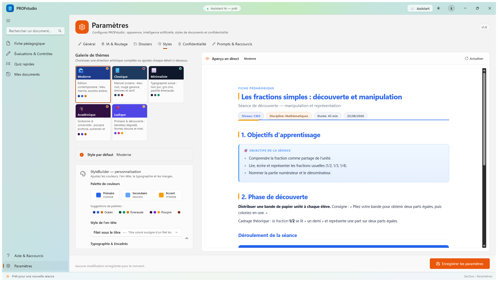
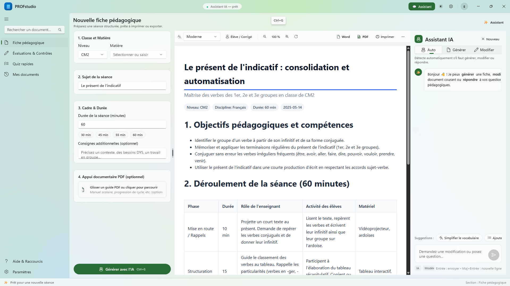
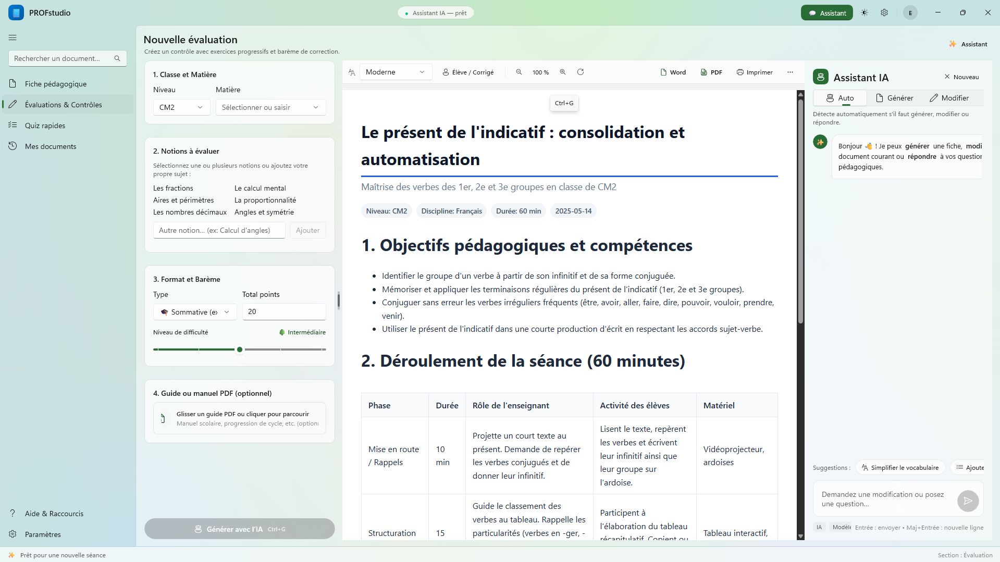
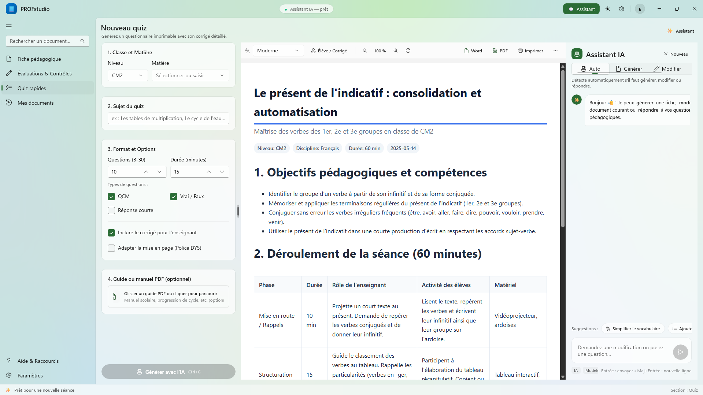
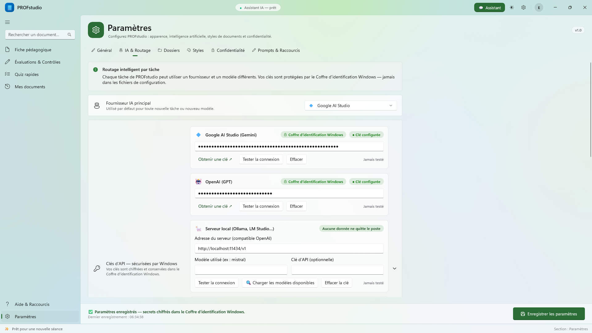
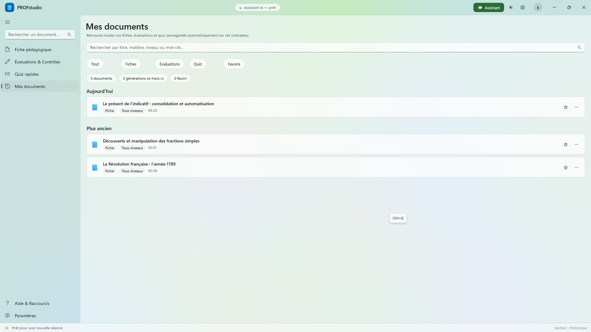
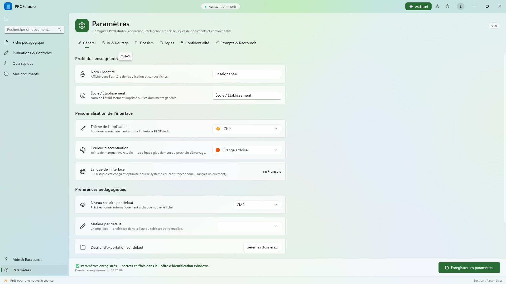

# PROFstudio for Windows

<div align="center">



### L'atelier pédagogique intelligent pour enseignants sous Windows 10 & 11

**Génération de fiches de cours, évaluations avec barèmes et quiz interactifs — Intégration de manuels scolaires PDF, aperçu WebView2 en direct et export Word / PDF haute fidélité.**

[-0078D4?logo=windows&logoColor=white)](https://github.com/walsoup/fichegen)
[](https://dotnet.microsoft.com/)
[](https://learn.microsoft.com/windows/apps/winui/)
[](https://learn.microsoft.com/dotnet/csharp/)
[](#-architecture-technique)
[-brightgreen?logo=xunit)](#-tests--qualit%C3%A9)
[](LICENSE)

[Téléchargements](#-installation--téléchargement) • [Fonctionnalités](#-fonctionnalités-clés) • [Styles Pédagogiques](#-moteur-de-styles-et-personnalisation) • [Fournisseurs IA](#-routage-ia--fournisseurs-supportés) • [Architecture](#-architecture-technique) • [Compilation](#-guide-de-compilation-et-développement)

</div>

---

## 🌟 Présentation

**PROFstudio for Windows** est une application bureautique native moderne (WinUI 3 / .NET 8 / C# 12) conçue sur mesure pour les professeurs du primaire, collège et lycée. 

Elle automatise la préparation des cours en combinant la puissance des modèles d'intelligence artificielle de pointe (**Google Gemini, OpenAI, Claude, Groq, DeepSeek, Vertex AI, Ollama**) avec les exigences réelles des programmes scolaires et l'analyse de vos propres manuels et guides pédagogiques au format PDF.

---

## 📸 Galerie d'Écrans

<div align="center">
<table>
  <tr>
    <td width="50%" align="center">
      <b>Fiche de cours structurée & Aperçu en direct</b><br/>
      
    </td>
    <td width="50%" align="center">
      <b>Évaluation sommative avec barème sur 20</b><br/>
      
    </td>
  </tr>
  <tr>
    <td width="50%" align="center">
      <b>Quiz interactif & Questions d'ancrage</b><br/>
      
    </td>
    <td width="50%" align="center">
      <b>Routage IA, modèles & Coffre-fort de clés API</b><br/>
      
    </td>
  </tr>
  <tr>
    <td width="50%" align="center">
      <b>Mes Documents & Recherche SQLite FTS5 instantanée</b><br/>
      
    </td>
    <td width="50%" align="center">
      <b>Personnalisation visuelle & Thèmes Fluent</b><br/>
      
    </td>
  </tr>
</table>
</div>

---

## ✨ Fonctionnalités Clés

### 📚 1. Génération Pédagogique Complète
* **Fiches de préparation pédagogique** : Objectifs, compétences ciblées, prérequis, matériel, déroulement minuté par phases (accroche, découverte, institutionnalisation, entraînement), différenciation pédagogique et trace écrite pour le cahier de cours.
* **Évaluations sommatives & formatives** : Exercices progressifs, situations problèmes, compétences évaluées et **barème de notation configurable** équilibré sur le total de points souhaité (ex. sur 20 pts ou 10 pts).
* **Quiz & QCM d'ancrage** : Questions à choix multiples et questions courtes avec justifications pédagogiques, pièges fréquents et **corrigé détaillé pour le professeur**.
* **Intégration de manuels scolaires (Guides PDF)** : Extraction vectorielle précise page par page via **UglyToad.PdfPig** avec détection automatique des chapitres et sommets de table des matières pour enrichir les prompts avec le contenu réel de vos manuels.

### 🎨 2. Moteur de Styles & Personnalisation
* **5 Préréglages graphiques soignés** :
  * 🎨 **Moderne (Défaut)** : Typographie Segoe UI Variable, cartes d'activités aux bordures subtiles, badges colorés.
  * 🏛️ **Classique** : Typographie Times New Roman / Georgia, en-tête institutionnel sobre, style formel.
  * 🌿 **Minimaliste** : Typographie épurée Aptos / Calibri, mise en page aérée sans encadrés superflus.
  * 🎓 **Académique** : Typographie Garamond, lettrines, séparateurs fins, format canonique universitaire.
  * 🎲 **Ludique** : Typographie Comic Neue, encadrés colorés, puces illustrées adaptées au cycle 2 et 3.
* **Éditeur de style intégré (Style Builder)** : Ajustez les couleurs d'accentuation, les polices de titre et de corps, le rayon d'arrondi des blocs et le type d'en-tête (standard, compact ou complet).
* **Thèmes d'application** : Thème Système, Clair, Sombre et **Noir absolu (OLED)**.

### ⚡ 3. Rendu en Direct & Édition Interactive
* **Streaming mot par mot** : Affichage en direct du texte généré par l'IA avec suivi visuel en 4 étapes pédagogiques (*Analyse du sujet ➔ Structuration ➔ Rédaction IA ➔ Rendu typographique*).
* **Édition manuelle instantanée** : Bouton **« Modifier »** dans la barre d'outils pour retoucher le titre, les consignes ou le corps en Markdown avec répercussion immédiate dans l'aperçu.
* **Recherche dans le document (Ctrl+F)** : Surlignage en temps réel et navigation occurrence par occurrence directement dans la vue WebView2.
* **Vue Élève / Vue Professeur** : Basculez en un clic pour masquer les solutions et barèmes lors de la distribution aux élèves.

### 📤 4. Exportations Multi-Formats Professionnelles
* **Microsoft Word (.docx)** : Génération directe de fichiers Open XML via `DocumentFormat.OpenXml` (vrais tableaux Word, titres stylés, paragraphes et listes natives — aucun HTML dégradé).
* **PDF Vectoriel haute résolution** : Rendu et pagination off-screen via `WebView2.PrintToPdfAsync` avec marges normalisées A4 (15 mm) et saut de page intelligent.
* **Format RTF (.rtf)** : Document universel pour les traitements de texte légers ou anciens.
* **Presse-papiers enrichi (CF_HTML / Plain Text)** : En-têtes à décalage d'octets UTF-8 pour un copier-coller parfait dans Microsoft Word, LibreOffice Writer, Pronote ou les ENT.

### 🤖 5. Assistant IA Pédagogique & Révision Visuelle (Diff)
* **Chat interactif latéral** : Demandez à l'IA d'adapter le niveau, de rajouter un exercice de remédiation, de simplifier le vocabulaire ou de traduire un passage.
* **Diff visuel Myers O(ND)** : Prévisualisez précisément chaque ligne ajoutée (vert) ou supprimée (rouge) avant d'appliquer les modifications au document courant.

### 🔒 6. Sécurité & Conformité RGPD
* **Zéro fuite de données** : Toutes les données, documents et paramètres sont stockés localement sur votre machine (`%LOCALAPPDATA%\FicheGen`).
* **Coffre-fort Windows Credential Locker** : Clés d'API chiffrées au repos via `PasswordVault` (avec bascule DPAPI `ProtectedData`). Jamais écrites en clair dans les fichiers de configuration ou les journaux de logs.
* **Mode 100% hors-ligne via Ollama** : Connectez votre modèle local (`localhost:11434`) avec prise en charge du loopback réseau MSIX (`privateNetworkClientServer`).

---

## 📦 Installation & Téléchargement

Plusieurs modes de distribution sont disponibles dans les [Releases GitHub](https://github.com/walsoup/fichegen/releases) :

| Format | Fichier | Description / Utilisation |
| :--- | :--- | :--- |
| **MSIX (Recommandé)** | `PROFstudio-v1.0.0-x64.msix` | Paquet moderne signé avec identité Windows, intégration du menu Démarrer et support du Credential Locker. |
| **Archive Portable** | `PROFstudio-v1.0.0-win-x64-portable.zip` | Aucun droit administrateur requis. Décompressez le `.zip` et lancez `FicheGen.App.exe`. |
| **Installateur Autonome** | `PROFstudio-Setup-win-x64.zip` | Contient le script `Setup.cmd` et l'application autonome pour un déploiement direct. |
| **Mises à jour Auto** | `PROFstudio.appinstaller` | Fichier manifeste pour l'installation et les mises à jour automatiques transparentes sous Windows. |

### 🚀 Installation rapide du paquet MSIX
1. Téléchargez `PROFstudio-v1.0.0-x64.msix` et `Install-MSIX.cmd` (ou `PROFstudio-DevCert.cer`).
2. Faites un clic droit sur `Install-MSIX.cmd` ➔ **Exécuter en tant qu'administrateur** pour installer le certificat de développement et le paquet en une seule opération.
3. Lancez **PROFstudio** depuis le menu Démarrer !

---

## 🧠 Routage IA & Fournisseurs Supportés

PROFstudio dispose d'une architecture multi-fournisseurs avec bascule à chaud et résilience automatique (Polly v8) :

```
                        ┌───────────────────────────────┐
                        │       LlmRouter (Orchestrateur)│
                        └──────────────┬────────────────┘
                                       │
         ┌─────────────────────────────┼────────────────────────────┐
         │                             │                            │
         ▼                             ▼                            ▼
┌──────────────────┐         ┌──────────────────┐         ┌──────────────────┐
│ GeminiAdapter    │         │ VertexAdapter    │         │ OpenAiAdapter    │
│ (Google Gemini)  │         │ (GCP OAuth2/ADC) │         │ (OpenAI, Groq,   │
│ - 2.5 Flash      │         │ - Vertex Gemini  │         │  DeepSeek, Local │
│ - 2.5 Pro        │         │   1.5 / 2.0      │         │  Ollama, etc.)   │
└──────────────────┘         └──────────────────┘         └──────────────────┘
```

| Fournisseur | Modèles recommandés | Authentification |
| :--- | :--- | :--- |
| **Google Gemini (Défaut)** | `gemini-2.5-flash`, `gemini-2.5-pro` | Clé API Google AI Studio |
| **Google Cloud Vertex AI** | `gemini-1.5-pro`, `gemini-2.0-flash` | Service Account JSON ou Application Default Credentials (ADC) |
| **OpenAI** | `gpt-4o`, `gpt-4o-mini`, `o3-mini` | Clé API OpenAI |
| **Groq** | `llama-3.3-70b-versatile`, `mixtral-8x7b-32768` | Clé API Groq (génération ultra-rapide) |
| **DeepSeek** | `deepseek-chat`, `deepseek-reasoner` | Clé API DeepSeek |
| **OpenRouter / Vercel** | Plus de 100 modèles unifiés | Clé API OpenRouter / Vercel AI |
| **Ollama (Local / Hors-ligne)** | `llama3.2`, `mistral`, `qwen2.5-coder` | Aucun (URL par défaut : `http://localhost:11434/v1`) |

---

## 🏛️ Architecture Technique

Le projet respecte scrupuleusement une architecture en **4 couches strictes** assurant modularité, maintenabilité et couverture de tests maximale :

```
src/
├── FicheGen.Core/              → .NET 8.0 standard. Zéro UI, zéro I/O.
│   ├── Ai/                     # Bâtisseurs de prompts, configurations IA, templates embarqués
│   ├── Documents/              # Modèle canonique GeneratedDocument (schéma de blocs polymorphes)
│   ├── Storage/                # DTOs immuables, AppSettings, HistoryEntry
│   ├── Toc/                    # Analyseur heuristique de tables des matières PDF à 3 niveaux
│   └── Services/               # Rendu HTML, validation de schémas, nettoyage JSON
│
├── FicheGen.Infrastructure/    → .NET 8.0 Windows (net8.0-windows10.0.19041.0).
│   ├── Ai/                     # LlmClient, LlmRouter, 4 Adaptateurs, SSE Stream Parser, Polly v8
│   ├── Storage/                # HistoryRepository (SQLite + indexation FTS5), SettingsStore atomique
│   ├── Security/               # Windows Credential Locker (PasswordVault) & fallback DPAPI
│   ├── Pdf/                    # Extraction de texte par glyphes via UglyToad.PdfPig (1-indexé)
│   ├── Export/                 # DocxExporter (Open XML), RtfDocumentWriter, ClipboardPackageBuilder
│   └── Diagnostics/            # Masquage de clés d'API (SecretRedactingPolicy), Serilog
│
└── FicheGen.App/               → WinUI 3 (Windows App SDK 1.6).
    ├── ViewModels/             # CommunityToolkit.Mvvm (Source Generators, zéro réflexion)
    ├── Views/                  # Pages XAML (FichePage, EvalPage, QuizPage, SettingsPage, HistoryPage)
    ├── Views/Controls/         # PreviewHost (WebView2), AssistantPane (Chat + Diff)
    ├── Services/               # WebView2PdfExporter, NavigationService, ThemeService, ExportWorkflowService
    └── Messages/               # Messages découplés WeakReferenceMessenger
```

### 📐 Modèle Canonique `GeneratedDocument`
Contrairement aux solutions classiques effectuant des allers-retours dégradés entre Markdown et HTML, PROFstudio repose sur un **schéma de blocs polymorphes fortement typé** :
- `HeaderBlock` (Titre, sous-titre, niveau, matière, durée)
- `ObjectiveBlock` (Objectifs notionnels, méthodologiques, compétences du socle)
- `PrerequisiteBlock` (Prérequis nécessaires)
- `TimelineBlock` (Phases séquencées avec minutage, rôle prof et activité élève)
- `ExerciseBlock` (Consignes, critères de réussite, barème de notation)
- `TextTraceBlock` (Bilan institutionnel pour le cahier de l'élève)
- `HomeworkBlock` (Travail personnel et prolongements)

---

## ⌨️ Raccourcis Clavier Pratiques

| Raccourci | Action |
| :--- | :--- |
| <kbd>Ctrl</kbd> + <kbd>G</kbd> | Lancer la génération du document courant |
| <kbd>Ctrl</kbd> + <kbd>N</kbd> | Réinitialiser le formulaire pour une nouvelle création |
| <kbd>Ctrl</kbd> + <kbd>P</kbd> | Imprimer le document ou exporter en PDF |
| <kbd>Ctrl</kbd> + <kbd>E</kbd> | Exporter au format Microsoft Word (.docx) |
| <kbd>Ctrl</kbd> + <kbd>Shift</kbd> + <kbd>E</kbd> | Exporter au format PDF vectoriel |
| <kbd>Ctrl</kbd> + <kbd>F</kbd> | Ouvrir la barre de recherche dans le document |
| <kbd>Ctrl</kbd> + <kbd>B</kbd> | Afficher / masquer le panneau de l'Assistant IA |
| <kbd>Ctrl</kbd> + <kbd>Shift</kbd> + <kbd>C</kbd> | Copier le document complet dans le presse-papiers |
| <kbd>Ctrl</kbd> + <kbd>S</kbd> | Enregistrer les paramètres dans la page de configuration |
| <kbd>Ctrl</kbd> + <kbd>,</kbd> | Ouvrir les Paramètres de l'application |

---

## 🧪 Tests & Qualité

Le projet intègre une suite de tests automatisés couvrant la logique métier, la résilience réseau, la sécurité et les exportations :

```powershell
# Exécuter l'intégralité des tests unitaires Core & Infrastructure
dotnet test tests/FicheGen.Core.Tests/FicheGen.Core.Tests.csproj
dotnet test tests/FicheGen.Infrastructure.Tests/FicheGen.Infrastructure.Tests.csproj
```

* **FicheGen.Core.Tests** (45 tests) : Validation des modèles de blocs, désérialisation JSON tolérante aux pannes, parseur de tables des matières PDF à 3 niveaux, générateurs de prompts et moteur de rendu HTML.
* **FicheGen.Infrastructure.Tests** (64 tests) : Simulation HTTP WireMock.Net pour les 4 adaptateurs IA, pipelines de résilience Polly, encodage du presse-papiers CF_HTML avec caractères accentués français, chiffrement DPAPI, stockage SQLite FTS5 et exportateurs Word / RTF.

---

## 🛠️ Guide de Compilation et Développement

### Prérequis
* **Système d'exploitation** : Windows 10 (version 1809 ou supérieure) ou Windows 11.
* **SDK** : [.NET 8.0 SDK](https://dotnet.microsoft.com/download/dotnet/8.0).
* **Environnement** : [Visual Studio 2022](https://visualstudio.microsoft.com/) (avec la charge de travail *Développement d'applications de bureau .NET*) ou VS Code / Rider.
* **Windows App SDK** : Version 1.6+.

### Compilation du projet
```powershell
# Cloner le dépôt
git clone https://github.com/walsoup/fichegen.git
cd fichegen

# Restaurer et compiler la solution en mode Debug x64
dotnet build src/FicheGen.App/FicheGen.App.csproj -c Debug -p:Platform=x64

# Lancer l'application
dotnet run --project src/FicheGen.App/FicheGen.App.csproj -c Debug -p:Platform=x64
```

### Empaquetage complet des installeurs (Release)
Pour générer les paquets MSIX signés, l'archive portable .ZIP et le bundle d'installation :
```powershell
powershell -ExecutionPolicy Bypass -File .\scripts\build-installers.ps1 -Configuration Release -Platform x64
```
Les fichiers générés seront placés dans le dossier `artifacts/dist/`.

---

## 📄 Licence & Crédits

Distribué sous licence **MIT**. Voir le fichier [LICENSE](LICENSE) pour plus d'informations.

Conçu avec passion pour faciliter le quotidien des professeurs et valoriser la liberté pédagogique.
