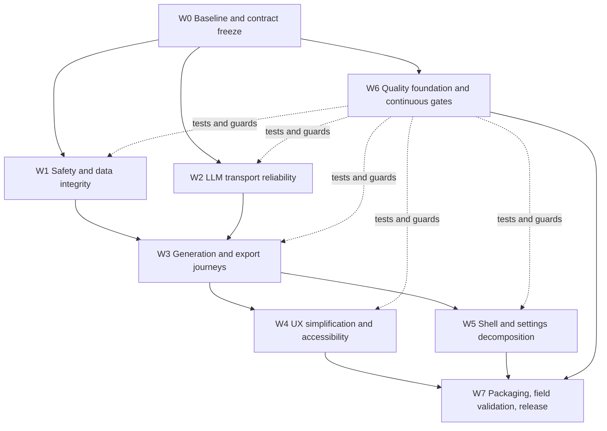

# PROFstudio Recovery Implementation Plan

**Prepared and last verified:** 2026-08-11  
**Authority:** `docs/WINDOWS_BLUEPRINT.md`, then `AGENTS.md`, then this plan  
**Objective:** turn the current buildable but unreliable prototype into a dependable, understandable, testable desktop product for French teachers.

**Document status:** recovery baseline and execution specification. Checklist items remain open until their stated evidence is captured. “Builds” means a clean command exits `0`; “passes” means all discovered tests pass without retries or ignored failures.

### How to use this plan

- Execute work in dependency order from section 3; do not use section 13 alone as a substitute for the workstream exit gates.
- For every item, record the owner, linked defect/change, before/after test, and verification command in the change description or issue tracker.
- A checked item must cite durable evidence: test name, artifact path, trace, screenshot/accessibility report, or command output.
- If implementation and blueprint conflict, stop and record a contract decision before changing either. Do not silently reinterpret the blueprint.
- Re-run the baseline after any contract migration that changes public constructors, serialization, DI composition, or test fixtures.

---

## 1. Current baseline

### 1.1 Verified on 2026-08-11

| Check | Result | Evidence / consequence |
|---|---|---|
| App x64 Debug build | Pass | Verified command exits `0`. |
| App x64 Release build | Pass | Verified command exits `0`. Release is buildable, but this is not yet a packaging or runtime smoke result. |
| Core tests | Fail | 23 pass, 3 fail. Failures cover mutable document collections, a stale/missing settings-secret contract, and secret disclosure in `ProviderRoute.ToString()`. |
| Infrastructure tests | Fail | 25 pass, 1 fails because split UTF-8 sequences are corrupted by `PlainTextStreamParser`. |
| E2E project build | Fail | 49 compiler errors. The tests target obsolete APIs and models and therefore provide no release confidence. |
| PDF export | Broken | `WebView2PdfExporter` still writes HTML to a `.pdf` path. |
| Assistant shell toggle | Broken | `MainWindow.ToggleAssistantVisibility(bool)` is empty. |
| Streaming resilience | Broken | `LlmClient.GenerateStreamAsync()` constructs a Polly pipeline but bypasses it. |
| OpenAI-compatible non-streaming | Broken | Stream mode is inferred from an endpoint that always contains `/chat/completions`. |
| Vertex streaming | Broken | Endpoint lacks `?alt=sse`. |
| Stream error handling | Broken | Provider stream parsers start parsing before validating HTTP status. |
| ViewModel generation guards | Partially implemented | Generator VMs have cancellation and `CanExecute`, but guards only test `!IsGenerating`, not complete validity/readiness. |
| History debounce | Implemented | A cancellable debounce exists. It still needs deterministic tests and lifecycle cleanup. |
| Password inputs | Implemented | Provider secrets use `PasswordBox`; this item must not be reimplemented. |
| DI host | Implemented | `App.xaml.cs` already uses Generic Host and dependency injection; the older review is stale here. |
| Settings atomic write | Partially implemented | Temporary-file move exists, but durability, recovery, and mutation during serialization need correction. |
| MainWindow maintainability | Critical | About 1,202 lines with navigation, shell state, theme, dialogs, command dispatch, and shortcuts mixed together. |
| Settings maintainability | Critical | About 1,135 VM lines and 998 XAML lines; direct file/WinRT storage work remains in the VM. |
| Application-layer placement | Incorrect | `GenerationOrchestrator` and `AssistantService` currently live in Infrastructure although the blueprint places use-case orchestrators in `FicheGen.App/Services`. Move them without introducing App dependencies into Infrastructure. |
| Credential fallback | Missing/inconsistent | DI registers `CredentialLockerStore` directly. `DpapiCredentialStore` exists but is not composed as an automatic fallback, and its file-per-secret format differs from the blueprint’s `settings.json/secretsProtected` contract. |
| Localization resources | Missing | No `.resw` files are present. User-visible French text is hardcoded across XAML/code; localization is a new recovery task, not an existing asset to preserve. |
| App/ViewModel test project | Missing | Only Core, Infrastructure, and E2E test projects exist. Deterministic ViewModel/application tests need a dedicated non-UI test project or a clearly separated test assembly. |
| CI/quality entry point | Missing | No repository workflow or single checked-in validation script currently enforces the matrix. |
| Test dependency licensing | Decision required | Test projects reference FluentAssertions 8.0.1, which emits a commercial-license warning. Confirm project eligibility/license or adopt an approved version/alternative before release. |

### 1.2 What is worth preserving

Do not restart the project. Preserve and harden:

- the four-layer architecture and clean project reference direction;
- `GeneratedDocument` as the canonical export/preview model;
- Generic Host and the existing DI composition root;
- CommunityToolkit MVVM source generators;
- the current generator/preview/assistant three-pane concept;
- SQLite + FTS5 history;
- provider adapter abstraction;
- existing quick-start cards, inline form validation surfaces, progress controls, empty preview state, first-run flow, and accessibility labels;
- existing xUnit, FluentAssertions, WireMock.Net, and FlaUI investments after contracts are reconciled.

Preservation of FluentAssertions is conditional on resolving the license decision above; test intent and readability are the assets to preserve, not a particular unapproved package version.

### 1.3 Recovery rules

1. Stop adding features until the release gates in section 12 are green.
2. Fix vertical user journeys, not isolated files.
3. Every bug fix begins with a failing automated test where practical.
4. Never preserve a stale test contract merely to make a test green. First decide whether the product contract or the test is authoritative.
5. Keep each change reviewable: one concern, one test set, no unrelated refactor.
6. Do not combine the UI redesign and deep infrastructure changes in the same change set.
7. Keep user-facing text in French and implementation identifiers/logging in English.
8. Never expose API keys in objects, logs, errors, diagnostics, settings JSON, or test output.
9. All async public contracts accept and propagate `CancellationToken`.
10. All observable collection/property mutation occurs on the UI thread.
11. No baseline claim is upgraded from “compiled” to “works” without a runtime or artifact assertion.
12. Never fix stale tests by restoring an obsolete production API unless the contract decision explicitly selects that API.

### 1.4 Baseline verification commands

Run from the repository root on a clean working tree. Capture SDK version (`dotnet --info`) with results because WinUI/MSIX behavior is toolchain-sensitive.

```powershell
dotnet restore FicheGen.Windows.slnx
dotnet build src/FicheGen.App/FicheGen.App.csproj -c Debug -p:Platform=x64 --no-restore
dotnet build src/FicheGen.App/FicheGen.App.csproj -c Release -p:Platform=x64 --no-restore
dotnet test tests/FicheGen.Core.Tests/FicheGen.Core.Tests.csproj --no-restore
dotnet test tests/FicheGen.Infrastructure.Tests/FicheGen.Infrastructure.Tests.csproj --no-restore
dotnet build tests/FicheGen.E2E.Tests/FicheGen.E2E.Tests.csproj --no-restore
```

Do not use existing `bin/`, `obj/`, or `artifacts/` output as evidence of a clean build.

---

## 2. Product definition and target journeys

The recovery should optimize five journeys for a teacher who is comfortable with Word but not necessarily with AI terminology.

### Journey J1: first launch to first document

1. Explain what the app creates using examples, not provider terminology.
2. Offer two routes:
   - recommended cloud setup;
   - private local setup with Ollama.
3. Explain what data leaves the machine before asking for a key.
4. Validate the selected provider immediately.
5. Land on a prefilled fiche form with a visible “create my first fiche” path.
6. Show a useful preview, then clear export actions.

**Success criteria:** a first-time user can produce and locate a DOCX/PDF without opening the full Settings page or understanding model routing.

### Journey J2: create a fiche, evaluation, or quiz

1. Choose document type in plain language.
2. Fill only essential fields first.
3. Reveal guide PDF and advanced instructions progressively.
4. Show why generation is unavailable instead of silently disabling it.
5. During generation show stage, elapsed activity, cancel action, and retry guidance.
6. Preserve form state and draft through navigation.

**Success criteria:** no duplicate generation, no lost draft, no unexplained disabled action, and cancellation returns to an editable form.

### Journey J3: inspect and export

1. Preview appears as soon as a valid document exists.
2. Export choices are named by destination: “Word”, “PDF”, “Copier”.
3. On completion show file name and “Ouvrir” / “Afficher dans le dossier”.
4. On failure show a user-actionable French message.
5. Undo/redo must restore independent immutable snapshots.

**Success criteria:** PDF begins with `%PDF-`, Word opens cleanly, clipboard retains accents, and the user can find the output.

### Journey J4: improve with the assistant

1. Assistant is hidden until requested and opens consistently on every page size.
2. State clearly whether the assistant will modify the document or only answer.
3. Stream without corrupt text or freezing UI.
4. Let the user stop generation.
5. Present a diff and require explicit apply/reject for edits.

**Success criteria:** shell toggle, compact overlay, cancellation, diff application, and navigation all preserve consistent assistant state.

### Journey J5: find and reuse prior work

1. History has a useful empty state and primary CTA.
2. Search is debounced and robust to punctuation/FTS operators.
3. Filters and favorites are understandable and keyboard accessible.
4. Destructive deletion is confirmed and only reflected after repository success.
5. Opening an item restores preview and offers duplicate/reuse.

**Success criteria:** searches remain responsive with 10,000 entries and failed deletes never desynchronize UI and storage.

---

## 3. Delivery map and dependencies



W6 starts in W0 with test classification and a repeatable entry point, then evolves alongside every change; its full exit gate is evaluated after W4/W5. Workstreams may run in parallel only where the graph permits. All workstream exit gates are mandatory.

---

## 4. Workstream W0 — establish truth and freeze contracts

### Goal

Create a trustworthy baseline before changing behavior. Current documents and tests disagree with current code.

### W0.1 Repository hygiene

- [ ] Review all untracked files before committing; do not discard them.
- [ ] Decide whether `ORIGINAL_REQUEST.md`, `PROJECT.md`, `TEST_INFRA.md`, `project_review.md`, stress tests, and E2E tests are permanent project assets.
- [ ] Exclude generated `bin/`, `obj/`, WebView2 profile data, coverage files, and packaged artifacts from source-control status.
- [ ] Add a clean-clone verification procedure that restores, builds, and tests without relying on current `bin/obj` output.
- [ ] Review the modified `FicheGen.Windows.slnx` separately; preserve intentional user changes and ensure every permanent test project is included exactly once.
- [ ] Decide whether `.agents/` is local tooling state or a versioned project asset; do not commit session/transient agent output accidentally.
- [ ] Record the required .NET SDK, Windows App SDK, Windows SDK, WebView2 runtime, target architecture, and packaging prerequisites in the existing project documentation.
- [ ] Add or verify `.gitignore` entries before generating coverage, packages, dumps, traces, or WebView2 profiles.

### W0.2 Contract reconciliation

For each mismatch, record one decision and update code/tests together:

- [ ] `AppSettings.SecretsProtected`: **retain this blueprint contract.** Credential Locker is primary; when it is unavailable, DPAPI-protected Base64 blobs belong under `settings.json/secretsProtected`. Define an immutable serialized shape, migration from the current file-per-secret DPAPI implementation, and export/import exclusion. Update stale tests to the final shape rather than deleting the contract.
- [ ] `GeneratedDocument`: adopt one immutable public shape and update all renderers/exporters/tests at once.
- [ ] E2E fixtures: replace obsolete `Run`, old constructors, `FilteredItems`, `ExportToPdfAsync`, `BuildCfHtmlPayload`, and old settings APIs with current public contracts.
- [ ] Decide which APIs are public product contracts and which are implementation details. UI automation should prefer automation IDs and user-visible behavior over direct VM calls.
- [ ] Resolve the discrepancy between `project_review.md` and current implementations; mark already completed items rather than scheduling duplicates.
- [ ] `GenerationOrchestrator` and `AssistantService`: confirm the blueprint’s App-layer ownership and migration boundary before tests hard-code their current Infrastructure namespaces.
- [ ] PDF export: select one App-owned off-screen WebView2 controller lifecycle consistent with blueprint §4.C.3; do not preserve the current HTML-writing fallback as a supported behavior.
- [ ] Credential API: define how vault-unavailable, entry-missing, entry-corrupt, DPAPI-unreadable, overwrite, delete, and migration outcomes are represented without leaking secrets.
- [ ] Provider request contract: define streaming as an explicit value available to adapters; endpoint text must never be used as the mode signal.
- [ ] Test taxonomy: classify each existing E2E test as UI automation, in-process application/component test, or obsolete. Move/rewrite it accordingly; a project named E2E must not provide false confidence through direct ViewModel calls.

Record each decision in this table before implementation:

| Contract | Authoritative source | Selected shape/behavior | Compatibility/migration | Tests updated | Status |
|---|---|---|---|---|---|
| Credentials / `SecretsProtected` | Blueprint §4.D | TBD | TBD | TBD | Open |
| `GeneratedDocument` | Blueprint §4.B + thread rule R3 | TBD | TBD | TBD | Open |
| LLM request/stream mode | Blueprint §4.A | TBD | TBD | TBD | Open |
| PDF export lifecycle | Blueprint §4.C.3 | TBD | No HTML fallback | TBD | Open |
| History list/detail shape | Blueprint §4.E.3 / §5.6 | TBD | TBD | TBD | Open |
| Shell command routing | Blueprint §2.5 / MVVM choice | Typed interface/message | Remove reflection | TBD | Open |

### W0.3 Build matrix

Create one repeatable validation entry point that runs:

1. x64 Debug app build;
2. x64 Release app build;
3. Core tests;
4. Infrastructure tests;
5. E2E compile;
6. architecture checks;
7. coverage collection;
8. packaging smoke check.

ARM64 compilation should be added after x64 is stable.

The entry point must:

- stop with a nonzero exit code on the first failed required gate while still making individual results readable;
- use `--no-restore` after an explicit restore so restore failures are distinguishable from build failures;
- emit test results and coverage to ignored deterministic directories;
- print SDK/runtime versions and the tested commit SHA;
- avoid requiring secrets, internet providers, or user profile state for unit/component stages;
- distinguish “E2E compiled”, “E2E discovered”, and “E2E executed”; none implies the others.

### W0.4 Dependency and license audit

- [ ] Inventory direct/transitive NuGet packages and native/runtime dependencies.
- [ ] Resolve the FluentAssertions 8 license warning for the intended product use; document the approved decision.
- [ ] Verify licenses for WebView2, PdfPig, SQLite, FlaUI, Verify.Xunit, and WireMock.Net and retain required notices.
- [ ] Pin or centrally manage package versions; record an update policy rather than using an unverifiable “latest” requirement.
- [ ] Run a vulnerability audit and triage findings without suppressing advisories globally.

### W0 exit gate

- App builds from a clean checkout.
- Core and Infrastructure test failures are documented as accepted red tests tied to work items.
- E2E infrastructure and all tests not blocked by an explicitly pending contract compile. Contract-blocked tests are listed individually with their selected replacement contract; they are not silently removed or broadly excluded.
- No retained test depends on an API that does not exist in either the current implementation or the selected frozen contract.
- Contract table has no unresolved decision needed by W1/W2.
- Every test is classified by layer; direct-VM “E2E” tests are moved or explicitly queued for replacement.
- Dependency/license decisions are recorded; no known license warning remains unexplained.

---

## 5. Workstream W1 — safety, secrets, immutability, and persistence

### W1.1 Immutable document model

**Files:** `GeneratedDocument.cs` and every renderer/exporter/fixture that consumes it.

- [ ] Replace mutable `List<T>` public properties with `ImmutableArray<T>` or a consistently serialized immutable/read-only representation.
- [ ] Make nested collections immutable too: runs, list items, rows, headers, key/value pairs, callout children, and column widths.
- [ ] Choose and document one null policy: required collections deserialize `null` as empty only for backward compatibility, or reject malformed payloads with a domain parse error. Apply it consistently at every nesting level.
- [ ] Ensure construction performs a defensive copy.
- [ ] Update the markdown renderer, JSON parser, HTML renderer, DOCX writer, RTF writer, assistant edits, and history deserialization.
- [ ] Change undo snapshots to independent immutable values; never store a reference to a mutable document.
- [ ] Preserve System.Text.Json polymorphic discriminators and verify old persisted history documents still deserialize or migrate deterministically.
- [ ] Avoid exposing mutable builders through properties; builders may exist only as local construction details and must freeze before publication.

**Tests:** mutation attempts, source-list mutation after construction, default/empty values, malformed/null collection input, JSON round-trip, old-history fixture compatibility, nested collection immutability, equality semantics, and undo after assistant edit.

### W1.2 Secret-safe DTOs and routes

- [ ] Override secret-bearing record `ToString()` methods.
- [ ] Keep credentials out of `ProviderRoute.Endpoint` wherever possible. If a provider requires query authentication, add it only while constructing the outbound request and ensure route stringification strips sensitive query values.
- [ ] Prefer authorization headers over query strings where provider APIs permit.
- [ ] Redact secrets from `LlmException.ResponseBody`, URI query strings, headers, Serilog events, structured properties, diagnostics ZIPs, provider payload echoes, and connection-test errors.
- [ ] Add a reflection-driven test that exercises every property whose name contains `Key`, `Secret`, `Token`, `Credential`, or `Authorization`.
- [ ] Verify settings JSON contains no transient API key values.
- [ ] Bound provider error bodies before reading/redacting them; redaction must occur before logging or exception construction, not only at presentation time.
- [ ] Test exact secrets, URL-encoded secrets, JSON-escaped values, bearer values, Google query keys, and short test tokens. Avoid broad redaction that destroys useful nonsecret diagnostics.
- [ ] Ensure record equality/deconstruction cannot accidentally encourage logging complete secret-bearing DTOs; prefer secret-free references/resolvers at boundaries.

### W1.3 Settings integrity

- [ ] Stop mutating the caller-owned `AppSettings` object to strip and restore secrets during serialization. Serialize a detached DTO/snapshot.
- [ ] Serialize writes with the existing semaphore.
- [ ] Write to a uniquely named same-directory temporary file, flush managed buffers, call `Flush(true)` where supported, then atomically replace/move without a delete-then-move gap.
- [ ] Keep one last-known-good backup and define exactly when it is rotated so a corrupt primary cannot overwrite a good backup.
- [ ] On corrupt primary JSON: quarantine it, attempt backup recovery, fall back to defaults, and notify the user without crashing.
- [ ] Add schema migrations by version; each migration is idempotent and tested.
- [ ] Debounce UI-initiated saves while ensuring navigation/app shutdown flushes pending changes.
- [ ] Clean orphaned temporary files safely at startup; never treat an incomplete `.tmp` file as authoritative without validation.
- [ ] Preserve file ACL/user scope and do not place settings, backups, or quarantined copies in a shared writable location.
- [ ] Define cancellation semantics: cancellation before commit leaves the old file intact; once atomic replacement begins, finish the commit and report the resulting state accurately.
- [ ] Return/surface a recoverable load outcome so the App layer can show the required French InfoBar; Infrastructure must not reference UI types.

**Fault-injection tests:** cancellation before/during write, serialization failure, flush failure where injectable, process residue (`.tmp`), corrupt primary with valid backup, corrupt primary and backup, unknown future schema, repeated migration, and concurrent saves.

### W1.4 Credential recovery

- [ ] Introduce one composite credential store: Credential Locker primary; blueprint-compatible DPAPI fallback only when the vault is unavailable, not merely when a key is absent.
- [ ] Store fallback DPAPI blobs in immutable `AppSettings.SecretsProtected` and exclude that property from settings export/import and diagnostics.
- [ ] Migrate any current `%LocalAppData%/FicheGen/credentials/*.dpapi` entries once, verify decryption and destination write, then remove the legacy entry only after successful migration.
- [ ] Distinguish “not found” from vault unavailable and corrupt/unprotectable data; do not silently route all failures to the same behavior.
- [ ] Catch machine/user-bound DPAPI failures, remove or quarantine only the unreadable credential entry after a recorded recovery decision, and request re-entry.
- [ ] Never clear all provider credentials because one provider entry is corrupt.
- [ ] Zero temporary byte buffers where practical and minimize secret lifetime; never put service-account JSON or API keys into status text.
- [ ] Test vault success, key missing, unavailable vault, malformed blob, copied blob, legacy migration, partial migration failure, overwrite, per-key delete, settings export, diagnostics export, and cancellation.

### W1.5 History integrity

- [ ] Keep all SQL parameterized.
- [ ] Replace ad hoc FTS sanitization with a tested query builder that safely quotes terms and handles punctuation/operators.
- [ ] Configure busy timeout and serialize writes.
- [ ] Add/verify schema version migrations.
- [ ] Return lightweight list projections; load full document/HTML only when opening an item.
- [ ] Delete from storage first, then update the UI collection; on failure retain the item and show recovery guidance.
- [ ] Define transaction boundaries for history row + FTS synchronization and verify rollback leaves both consistent.
- [ ] Use stable ordering (`created_utc`, then ID) and keyset/page semantics so paging does not duplicate or skip rows during concurrent inserts.
- [ ] Cap query length and term count, normalize Unicode consistently, and test apostrophes, quotes, hyphens, colons, parentheses, `NEAR`, `OR`, `*`, accents, and empty/whitespace queries.
- [ ] Verify WAL/busy-timeout behavior under concurrent search, favorite, rename, retention, and delete operations; do not share unsafe SQLite connection state across threads.
- [ ] Back up or migrate before destructive schema changes and fail startup into a recoverable state rather than resetting history silently.

### W1 exit gate

- All persistence/security tests pass.
- Deliberately corrupted settings and DPAPI entries recover without process termination.
- No plaintext secret appears in logs, diagnostics, `ToString()`, exceptions, routes, or JSON; DPAPI ciphertext appears only in the documented `secretsProtected` fallback property and is excluded from export/diagnostics.
- Document graphs cannot be mutated after construction.

---

## 6. Workstream W2 — LLM transport and streaming reliability

### W2.1 Explicit request mode

- [ ] Add an explicit streaming flag/request mode to the adapter request contract and make it required at request construction; never infer it from URL text or parser choice.
- [ ] Ensure non-streaming OpenAI-compatible calls set `stream: false` and parse one JSON response.
- [ ] Ensure streaming calls set `stream: true` and parse SSE.
- [ ] Apply `LlmRequest.ModelOverride` with highest model-selection precedence, after validating/normalizing the selected provider and before route/default model fallback.
- [ ] Normalize provider aliases once at the router boundary and use the normalized provider key for route lookup and default-model lookup; unknown providers must fail configuration instead of silently falling back to Gemini.
- [ ] Keep route selection free of credentials. Authentication is applied to the short-lived `HttpRequestMessage`, not persisted in route DTOs.
- [ ] Define whether JSON response mode is supported per provider/model and fail clearly when unsupported instead of sending provider-specific fields blindly.

### W2.2 Correct provider endpoints

- [ ] Gemini streaming: retain `alt=sse`.
- [ ] Vertex streaming: add `alt=sse` while preserving any existing query parameters.
- [ ] OpenAI-compatible/Ollama: normalize base URI and avoid accidental double `/v1` or `/chat/completions`.
- [ ] Vercel: honor route model and JSON/text response mode.
- [ ] Validate URLs at the settings boundary and allow only expected `http/https` schemes; warn before non-loopback plaintext HTTP.
- [ ] Build URIs with `Uri`/`UriBuilder` semantics so model/project/region values are escaped and existing query parameters are preserved exactly once.
- [ ] Reject userinfo, fragments, malformed hosts, and unsupported schemes. For user-configured remote endpoints, document the SSRF/trust boundary and do not follow redirects that could forward authorization to a different origin.
- [ ] Treat `localhost`, `127.0.0.1`, and `[::1]` consistently for local-provider policy; do not classify arbitrary private-network hosts as loopback.

### W2.3 Status-first parsing

For all adapters:

- [ ] Validate status before opening a success stream parser.
- [ ] Read only a bounded error body (define the byte limit and truncation marker) and dispose the response deterministically.
- [ ] map 401/403 to credentials, 404 to endpoint/model, 408/timeouts to connectivity, 429 to quota/rate limit, 5xx to provider outage;
- [ ] parse both delta and date forms of `Retry-After`;
- [ ] handle provider safety/blocked finish reasons as explicit domain errors, not empty output.
- [ ] Map malformed success payloads and unexpected content types to protocol errors, preserving a redacted bounded diagnostic excerpt.
- [ ] Use one shared status/error mapper to prevent adapter drift while retaining provider-specific safe details and request/correlation IDs.
- [ ] Treat `204`, empty success bodies, and successful streams with no usable token as explicit protocol/provider outcomes, not valid empty documents.

### W2.4 Streaming resilience

- [ ] Execute connection establishment inside the streaming Polly pipeline.
- [ ] Retry only before the first user-visible token; never replay a partially delivered generation.
- [ ] Use per-attempt connection/header timeout and a 60-second idle watchdog for long streams; do not impose a short overall timeout after streaming begins. Keep non-streaming per-attempt/overall timeouts aligned with blueprint §4.A.5.
- [ ] Put circuit breaker outside retry so open circuits fail fast.
- [ ] Surface retry state in French through a progress/status abstraction.
- [ ] Ensure cancellation immediately aborts HTTP, channel producer, batch consumer, and UI state.
- [ ] Define retryable operations narrowly: transient network/408/429/5xx before first token only. Never retry authentication, invalid request, safety block, malformed payload, caller cancellation, or non-idempotent post-token failures.
- [ ] Rebuild `HttpRequestMessage` and content for every attempt; never resend a disposed or previously sent message.
- [ ] Honor bounded `Retry-After` values and cancellation during delay; reject unreasonable provider delays in favor of an actionable failure.
- [ ] Ensure circuit-breaker partitioning is intentional (for example, by provider/origin) so one failing provider does not disable unrelated routes.
- [ ] Propagate producer exceptions through the channel and preserve the original domain exception for the consumer.

### W2.5 Parser correctness

- [ ] Replace chunk-local UTF-8 decoding with `StreamReader` or a stateful `Decoder`.
- [ ] Support SSE `data:` with no space or one optional leading space after the colon without stripping meaningful additional payload whitespace.
- [ ] Support CRLF/LF, UTF-8 BOM policy, multiline `data` events joined with `\n`, blank event boundaries, comments, and unknown fields.
- [ ] Preserve final events without a trailing blank line.
- [ ] Complete channels with producer exceptions.
- [ ] Enforce 50 ms batching without flushing every token.
- [ ] Bound channels to provide back-pressure.
- [ ] Set maximum line/event sizes and fail with a protocol error instead of unbounded buffering.
- [ ] For Vercel raw text, preserve decoder state across arbitrary byte splits and flush the decoder at EOF.
- [ ] Define `[DONE]` handling at the provider adapter, not as a generic SSE parser concern.

### W2.6 Provider test matrix

For Gemini, Vertex, OpenAI-compatible/Ollama, and Vercel, test:

- successful non-streaming;
- successful streaming with accented French text split at every byte boundary;
- SSE split at every byte boundary and line ending boundary, multiline events, comments, EOF without blank line, and oversized events;
- cancellation before headers and mid-stream;
- 401, 403, 404, 429 with both `Retry-After` formats, 500, malformed body;
- connection reset before first token and after first token;
- safety-blocked response;
- unknown model and invalid endpoint;
- request mode/body assertion (`stream` true/false), model-override precedence, URI normalization, and redirect/auth behavior;
- no plaintext secret leakage in thrown exceptions, logs, request snapshots, or WireMock journals retained as test artifacts.

### W2 exit gate

- All provider contract tests pass under WireMock.Net.
- No replacement characters appear in valid UTF-8 streams.
- Partial streams are never silently replayed.
- Errors become actionable domain messages rather than generated document text.
- Streaming cancellation reaches the caller within a documented target and leaves no producer/task running.
- Retry/circuit/timeout tests use deterministic or controlled time; the suite does not sleep through real backoff intervals.

---

## 7. Workstream W3 — generation, preview, export, and cancellation

### W3.1 Shared generation state machine

Create a small application-layer orchestration contract with explicit states:

`Idle -> Validating -> ReadingGuide -> ContactingProvider -> Streaming/Parsing -> Rendering -> SavingHistory -> Completed`

Any active state may transition to `Cancelling -> Cancelled` or `Failed`.

- [ ] Move/replace the current Infrastructure `GenerationOrchestrator` with an App-layer, view-free application service; Infrastructure remains responsible only for provider/PDF/storage/export implementations.
- [ ] Put state transitions in one application service, not duplicated in three VMs, and reject illegal transitions deterministically.
- [ ] Snapshot immutable request/config data on the UI thread.
- [ ] Cancel and dispose the previous CTS before starting another operation.
- [ ] Use a monotonically unique operation ID captured by every progress/result callback so late progress, success, failure, or cancellation cannot overwrite a newer result.
- [ ] Disable generation unless the form is valid and the provider is ready.
- [ ] Expose the reason generation is unavailable.
- [ ] Treat `OperationCanceledException` as normal cancellation.
- [ ] Stop elapsed and draft timers on completion, navigation, and disposal.
- [ ] Define ownership of the current document, draft, progress, and history save; avoid duplicate mutable state across three generator VMs and `ResultViewModel`.
- [ ] Marshal observable state updates through one UI dispatcher abstraction that is replaceable in tests; never dispatch pure Core/Infrastructure work.
- [ ] Define history-save failure semantics: retain the completed document and offer retry rather than reporting generation as wholly failed.
- [ ] Make retry start from a fresh immutable snapshot and operation ID; never reuse a consumed stream, CTS, or request message.

**Transition tests:** normal completion for each form, validation failure before work, double invocation, cancellation at every stage, failure at every stage, late progress/result after cancellation, navigation/deactivation, history-save failure, and immediate retry.

### W3.2 Form-specific validation

**Fiche**

- require level, subject, topic, and duration 15–180;
- if guide mode is on, require an accessible PDF;
- reset guide-derived page state when the PDF changes;
- reject invalid page ranges and explain 1-based physical/printed page semantics only where needed.
- normalize only harmless whitespace; preserve teacher-entered accents and meaningful punctuation;
- make command `CanExecute` update when every dependent field/provider-readiness value changes.

**Evaluation**

- require at least one topic;
- validate total points and custom exercise allocations;
- constrain duration and difficulty;
- preserve chips and draft state.
- reject negative, zero, duplicate, or over-allocated point values with field-level French guidance.

**Quiz**

- constrain question count to 3–30 per blueprint;
- require at least one question type;
- constrain duration to 5–30;
- make correction and dyslexia options understandable.
- define behavior when incompatible question-type/count choices are restored from an older draft.

### W3.3 PDF guide handling

- [ ] Validate extension and signature at the boundary.
- [ ] Enforce a documented file-size/page-count policy before expensive work, then process selected pages lazily/in bounded batches rather than loading an entire 200 MB book.
- [ ] Detect image-only pages and show “Ce document nécessite une reconnaissance de texte (OCR).”
- [ ] Preserve PdfPig 1-based indexing.
- [ ] Test page offsets, ligatures, French punctuation, wrapped ToC titles, page ranges, and malformed PDFs.
- [ ] Cancel extraction promptly.
- [ ] Treat the selected file as untrusted input: prevent path confusion, decompression/resource exhaustion where applicable, and raw exception disclosure.
- [ ] Cache only content keyed by a stable file identity/version and selected range; invalidate when the file changes and cap cache size.
- [ ] Define encrypted/password-protected PDF behavior and provide an actionable French message without requesting passwords through logs or diagnostics.

### W3.4 Real PDF export

Replace the stub with the blueprint’s App-owned, UI-affined off-screen WebView2 controller pipeline. “Off-screen” means the controller is never shown; do not create a visible/transparent hidden-window hack or write HTML as a fallback PDF:

1. create a dedicated `CoreWebView2Environment` and off-screen controller bound to an App-owned HWND, or reuse a coordinator that guarantees equivalent lifetime and UI-thread affinity;
2. keep the environment/controller/core alive until printing completes and close/dispose them deterministically in `finally`;
3. configure virtual-host mapping to trusted packaged/local web assets; never navigate directly to teacher content or interpolate it into a file URL;
4. navigate to the print shell and wait for navigation, shell “ready”, posted-document render completion, fonts, and layout with bounded cancellation-aware waits;
5. send sanitized document/theme data with `PostWebMessageAsJson`; do not use a Base64 HTML bridge;
6. create explicit A4 print settings (portrait, preset margins converted correctly, backgrounds enabled, headers/footers and selection disabled);
7. call `CoreWebView2.PrintToPdfAsync()` to a same-volume temporary destination and check its returned success result;
8. validate file existence, nonzero length, `%PDF-` signature, and a minimum structural smoke assertion before publication;
9. atomically move/replace the completed temporary PDF at the selected destination without destroying a valid existing file on failure;
10. clean up event handlers, controller, and temporary files on success, cancellation, timeout, process failure, and exception;
11. recreate the WebView2 export host at most once after `ProcessFailed`, then show an actionable French error.

Never call WebView2 from Infrastructure or a background thread.

**Test split:** pure tests cover HTML/payload/print-setting construction; an App integration test on a self-hosted Windows runner performs real WebView2 export and asserts signature, nonzero pages/selectable accented text where tooling permits, cancellation cleanup, timeout, and process-failure recovery. A mocked `%PDF-` file is not sufficient evidence.

### W3.5 Export workflow

- [ ] Implement/inject one App-layer export workflow used by `ResultViewModel`.
- [ ] Use file pickers initialized with the window handle.
- [ ] Add DOCX, PDF, RTF, clipboard, print, open-file, and open-folder outcomes.
- [ ] Preserve French characters in CF_HTML by calculating UTF-8 byte offsets.
- [ ] Sanitize AI-derived HTML and enforce CSP before preview/export.
- [ ] Distinguish cancellation, permission denied, disk full, file in use, WebView2 unavailable, and malformed document.
- [ ] Use cancellation tokens instead of `CancellationToken.None` in long operations.
- [ ] Return a typed export outcome containing format, destination, cancellation/failure category, and safe user message; do not infer success from absence of an exception.
- [ ] Use safe suggested filenames: remove invalid/reserved names, trim trailing dots/spaces, cap length, preserve accents where supported, and prevent path traversal.
- [ ] Write every file format to a temporary file and publish only after format-specific validation; preserve an existing destination if generation fails.
- [ ] Validate DOCX as an OPC/ZIP package with required parts and RTF with a valid header; test opening with Word/LibreOffice separately from structural unit tests.
- [ ] Build CF_HTML byte offsets from the final UTF-8 payload, including header width and fragment markers; test offsets by slicing bytes, not .NET character indices.
- [ ] Do not pass unsanitized provider HTML to preview, clipboard, print, diagnostics, or history, even temporarily.

### W3 exit gate

- Each generator supports generate, cancel, retry, navigate away, and generate again without stale updates.
- PDF, DOCX, RTF, and clipboard artifacts pass content/signature tests with French accents.
- Export success exposes the resulting file to the user.
- Guide failures produce clear messages and do not freeze the UI.

---

## 8. Workstream W4 — UX simplification for the target demographic

### W4.1 Information architecture

Keep top-level navigation limited to:

- Créer;
- Historique;
- Paramètres;
- Aide.

Within “Créer”, use a clear document-type selector for Fiche, Évaluation, and Quiz. If retaining separate navigation entries, use identical layout and terminology across all three.

- [ ] Preserve deep-link/activation and last-page restoration behavior when changing navigation tags.
- [ ] Keep primary navigation order stable for keyboard shortcuts and automation IDs.
- [ ] Perform a terminology inventory before changing labels; define one French term for each recurring concept and use it in UI, errors, help, and tests.

### W4.2 Progressive disclosure

On generator pages, show essential fields first:

1. niveau;
2. matière;
3. sujet/notions;
4. durée;
5. primary generate action.

Move these into collapsible “Options avancées”:

- prompt enhancers;
- additional instructions;
- guide page details;
- model/provider overrides;
- specialist formatting.

Avoid exposing terms such as model routing, temperature, endpoint, SSE, tokens, and JSON outside an explicitly advanced settings section.

- [ ] Persist expansion state only when it helps the user; do not reopen advanced sections on first-run by accident.
- [ ] Keep validation summaries linked to the corresponding controls and move focus to the first invalid essential field after an attempted generation.
- [ ] Preserve all entered values when advanced sections collapse.

### W4.3 First-run redesign

- [ ] Replace unsupported confidentiality absolutes such as “100% confidentiel” when cloud providers are enabled.
- [ ] Show a concise data-flow disclosure for each provider choice.
- [ ] Ask for only the provider configuration needed to make the first generation succeed.
- [ ] Add “Tester la connexion” before completion.
- [ ] Make skip behavior explicit: the app opens in demo/setup-required state, not a broken generation state.
- [ ] Preserve telemetry off by default.
- [ ] Add a reopenable “Assistant de configuration” in Settings.
- [ ] Treat connection success as provider/model specific and time-bounded; a stale prior success must not imply current readiness indefinitely.
- [ ] Never echo a key in validation, clipboard, accessibility name, automation property, logs, or screenshots; clear secrets from controls after secure persistence where practical.
- [ ] State accurately that cloud prompts/document excerpts may leave the device and name the selected provider; local mode claims must account for configured remote Ollama/proxy endpoints.
- [ ] Define first-run cancellation, window close, provider failure, offline mode, and re-entry behavior with deterministic persisted state.

### W4.4 Generation feedback

- [ ] Use plain stage labels: “Lecture du guide”, “Préparation”, “Rédaction”, “Mise en page”, “Enregistrement”.
- [ ] Keep one prominent primary action.
- [ ] Show `Annuler` only while active.
- [ ] Show retry guidance with a direct settings action for credential/configuration errors.
- [ ] Avoid decorative emoji as the only status signal.
- [ ] Announce stage changes sparingly through an accessibility live region; do not announce elapsed time or each token.
- [ ] Keep the completed document available when history save/export follow-up fails and present the next action beside the error.

### W4.5 Preview and assistant

- [ ] Make the initial preview empty state instructive and include a CTA.
- [ ] Group export actions and label them, rather than relying solely on icons/tooltips.
- [ ] Make the assistant opt-in and remember preference.
- [ ] Under 1280 px, use a modal side overlay without physically reparenting a live XAML control.
- [ ] Trap focus appropriately in the overlay and restore focus to its trigger on close.
- [ ] Announce streaming and completion to assistive technology without announcing every token.
- [ ] Preserve assistant draft, mode, and document association across responsive transitions without reparenting a live control between visual trees.
- [ ] Define compact-overlay dismissal by close button, Escape, light-dismiss policy, navigation, and window deactivation; restore focus only when the original trigger still exists.

### W4.6 Settings simplification

Use sections:

1. **Profil et documents** — teacher, school, defaults, export folder;
2. **Assistant IA** — recommended provider, connection status, keys;
3. **Guides pédagogiques** — guide folder/cache;
4. **Apparence et accessibilité**;
5. **Confidentialité et données**;
6. **Avancé** — routing, models, temperatures, diagnostics.

- [ ] Hide routing matrix and temperatures by default.
- [ ] Show one status per provider: configured, testing, ready, action required.
- [ ] Explain local versus cloud data flow.
- [ ] Save predictably and show a compact “Enregistré” state.
- [ ] Confirm destructive cache/history operations.
- [ ] Separate “saved locally” from “connection tested” status; never display a generic success that masks a failed credential write.
- [ ] Keep provider-specific advanced fields hidden until the provider is selected, while retaining their values securely.

### W4.7 Accessibility and input

- [ ] Finish `AutomationProperties.Name`, `HelpText`, headings, and landmark semantics.
- [ ] Replace invalid bindings such as `AutomationProperties.Name="{Binding}"` where they do not produce a stable accessible name.
- [ ] Define logical tab order and keyboard reachability.
- [ ] Meet 44x44 effective targets for touch where practical.
- [ ] Verify 200% scaling, high contrast, Windows text scaling, keyboard-only use, Narrator, and color-independent status indicators.
- [ ] Introduce `.resw` resource infrastructure (none exists today), migrate all user-visible strings from XAML/code, and add a check that blocks newly hardcoded UI strings. Avoid mixed French/English labels such as “Global Provider”.
- [ ] Give each interactive control a stable, unique automation ID independent of localized display text.
- [ ] Verify focus order after validation errors, dialogs, navigation, assistant open/close, generation completion, and export completion.
- [ ] Verify minimum window size, 1280 px assistant breakpoint, 1000 px navigation breakpoint, 200% display scale, and Windows text scaling separately; they are not equivalent tests.
- [ ] Ensure error/status meaning is conveyed by text and accessible state, not color, icon, animation, or position alone.

### W4 UX validation

Run five moderated task scripts with representative teachers or proxies:

1. configure and create first fiche;
2. create an evaluation from a PDF guide;
3. cancel and retry a quiz;
4. improve a document and export to Word/PDF;
5. find and reuse a historical document.

Capture task completion, errors, requests for help, backtracking, and terminology confusion. Fix blockers before visual polish.

For each script, record: participant profile, build/commit, provider mode, task success without moderator intervention, completion time, wrong turns, help requests, severity, and follow-up change. Do not treat five participants as statistical proof; use them to find high-severity usability failures.

### W4 exit gate

- Essential workflows can be completed keyboard-only and at 200% scaling.
- Advanced AI concepts are not required for ordinary use.
- Every disabled primary action has an understandable reason.
- First-run claims accurately reflect cloud/local data flow.
- No user-visible string required by the tested journeys is hardcoded outside resources, except dynamic teacher/provider content.
- Automated accessibility scanning has no critical violations, and manual Narrator/keyboard scripts are attached as evidence.

---

## 9. Workstream W5 — architecture and maintainability

### W5.0 Restore the intended layer ownership

- [ ] Move generation and assistant use-case orchestration from `FicheGen.Infrastructure/Services` to `FicheGen.App/Services`, or replace them with App-owned implementations behind Core-defined contracts.
- [ ] Keep provider adapters, HTTP, PDF extraction, SQLite, credentials, settings persistence, DOCX, and RTF implementations in Infrastructure.
- [ ] Keep UI-affined WebView2 export, pickers, dialogs, dispatcher abstractions, and shell coordinators in App.
- [ ] Ensure Core remains `net8.0`, pure, and independent of WinRT, file, HTTP, SQLite, logging, DI, and UI packages.
- [ ] Update DI registrations and tests in the same change; do not leave duplicate old/new orchestrators reachable.

**Boundary evidence:** project references remain one-way, architecture tests pass, and namespace/file searches show no XAML/Dispatcher types in Infrastructure and no direct I/O/provider clients in ViewModels.

### W5.1 Thin `MainWindow`

Decompose by responsibility, not merely into arbitrary partial files:

- `INavigationService`: page/tag map, current navigation, initial navigation, selection synchronization;
- `IShellStateService`: window/shell preference load and save;
- `IThemeService`: theme and caption-button updates;
- `INotificationService`: InfoBar/TeachingTip/status announcements;
- `IShortcutService` or typed command router: global keyboard action mapping;
- `IAssistantPaneCoordinator`: visible state and responsive presentation;
- `IPreviewCoordinator`: shell-level preview actions only if genuinely cross-page.

Keep `MainWindow` responsible for visual composition and lifecycle wiring only.

- [ ] Define service lifetimes and ownership before extraction; avoid turning the god object into several singleton god services with shared mutable state.
- [ ] Move initial-navigation selection into one idempotent path used by load/activation and test cold launch, reactivation, and protocol/file activation separately.
- [ ] Keep window-specific operations (HWND, title bar, backdrop, caption buttons) behind interfaces only where they need testing or reuse; do not abstract trivial XAML event wiring.
- [ ] Set a measurable target: `MainWindow` should contain no feature command-name strings, reflection, provider/settings business rules, or direct child-VM method invocation.

### W5.2 Typed cross-feature commands

- [ ] Remove `TryExecuteCommand` and `TryInvokeMethod` reflection.
- [ ] Use typed messages or small interfaces for new/reset, generate, cancel, export, print, undo, global search, preview toggle, and assistant visibility.
- [ ] Register/unregister message recipients with page/VM lifetime.
- [ ] Add compile-time tests for every shell shortcut mapping.
- [ ] Define command availability and handled/unhandled outcomes so shortcuts do not silently do nothing when a page lacks a capability.
- [ ] Prevent duplicate execution when a focused control and shell accelerator both handle the same gesture.
- [ ] Keep typed capability interfaces narrow (for example generation, export, undo) and avoid one universal shell-command interface.

### W5.3 Assistant visibility

- [ ] Implement one `AssistantVisibilityChangedMessage(bool)` or coordinator API.
- [ ] Apply it after navigation and breakpoint changes.
- [ ] Persist preference through the settings store.
- [ ] Ensure the same assistant instance is not parented to two visual trees.
- [ ] Verify title-bar toggle, page FAB, overlay close, `Ctrl+B`, navigation, and resize.
- [ ] Make coordinator updates idempotent and ensure rapid resize/toggle events cannot attach duplicate handlers or create multiple pane instances.
- [ ] Persist the user preference independently from temporary responsive presentation: compact overlay closure and breakpoint auto-collapse must not accidentally overwrite the explicit preference unless specified.

### W5.4 Settings decomposition

Split by behavior:

- profile/defaults;
- providers/credentials;
- routing/models;
- guide/cache;
- appearance/accessibility;
- privacy/data/diagnostics.

Use tab-specific child VMs or partial files only where ownership remains clear. Split XAML into lazy-loaded `UserControl`s. Move file, directory, WinRT storage, model scanning, startup registration, cache, and diagnostics orchestration into services.

- [ ] Remove the direct `HttpClient`, `Directory`, and `StorageFolder` use confirmed in `SettingsViewModel`; connection testing, cache management, folder validation, and diagnostics each receive typed services/outcomes.
- [ ] Keep one settings edit session/snapshot with explicit save/reload semantics so child VMs do not overwrite each other with stale copies.
- [ ] Coordinate credential writes and nonsecret settings commit so partial failure is visible and recoverable; never report “Enregistré” if only one side succeeded.
- [ ] Lazy-load visual sections without delaying required settings validation or creating duplicate child VMs/event subscriptions.

### W5.5 ViewModel lifecycle

- [ ] Add explicit activation/deactivation or `IDisposable` where VMs own timers, CTSs, or event subscriptions.
- [ ] Stop draft/elapsed timers.
- [ ] Unsubscribe `AssistantViewModel` from `ResultViewModel.PropertyChanged`.
- [ ] Cancel history debounce and in-flight loads.
- [ ] Cap assistant messages and summarize/archive old context.
- [ ] Define DI lifetimes intentionally: singleton document/session state; transient page state; no accidental event roots.
- [ ] Make deactivation idempotent and safe before activation; disposal must not block the UI thread or swallow unfinished save failures.
- [ ] Use weak messaging only where ownership cannot be explicit; prefer deterministic registration tokens/lifetimes over relying on garbage collection.
- [ ] Add leak tests or repeated-navigation weak-reference checks for pages/VMs with timers, events, WebView2, or messenger subscriptions.

### W5.6 Binding and code-behind

- [ ] Prefer compiled `x:Bind` with typed data contexts for stable page bindings.
- [ ] Move business validation and state mutation from page code-behind into VMs/services.
- [ ] Keep code-behind for visual-only concerns such as focus, drag/drop adaptation, and responsive states.
- [ ] Replace manual `Button.IsEnabled` changes with command `CanExecute`.
- [ ] Ensure generated command/property names used by XAML are compile-time checked where WinUI supports it; retain runtime binding only when required and cover it with UI smoke tests.
- [ ] Do not move visual-only responsive/focus code into ViewModels merely to reduce code-behind line counts.

### W5 exit gate

- `MainWindow` contains no reflection command dispatch and no feature business logic.
- Settings VM/view are separated into cohesive units.
- VMs release all owned resources deterministically.
- Layer rules are enforced by automated architecture tests.
- Application orchestrators live in App/Services and Infrastructure contains no use-case/UI orchestration.
- Repeated navigation/toggle/settings-open cycles show no unbounded VM, timer, event-handler, or WebView2 growth.

---

## 10. Workstream W6 — rebuild the quality system

### W6.1 Test pyramid

**Core unit tests**

- immutable document schema and serialization;
- prompt builders for fiche/evaluation/quiz/assistant;
- renderers and sanitization;
- ToC parser and offset detector;
- diff mapper and style presets;
- LLM request validation.

**Infrastructure component tests**

- every provider and stream parser via WireMock.Net;
- settings atomicity/migrations/recovery;
- SQLite migrations, FTS, concurrency, retention;
- PDF extraction edge cases;
- DOCX/RTF/clipboard artifact validation;
- credential fallback and redaction.

**App/ViewModel tests**

- validation and `CanExecute`;
- generation state machine and late-completion suppression;
- cancellation/disposal;
- history debounce/delete consistency;
- assistant apply/reject/undo;
- shell message routing.

Create a dedicated `FicheGen.App.Tests` (or equivalently named) project for deterministic application/ViewModel tests that do not launch the packaged UI. Use dispatcher, clock, delay, picker, dialog, and provider fakes so tests do not depend on the developer desktop or wall-clock sleeps.

**E2E UI tests**

- only real user-visible journeys;
- use automation IDs/names, not direct VM implementation APIs;
- fake external providers at process boundaries;
- isolate local app data per test;
- compile and discover on every build; run smoke subset on every change and full suite on release validation.
- launch the built/package-under-test as a separate process; tests that instantiate ViewModels directly belong in App tests, not E2E;
- use explicit readiness/condition waits instead of fixed sleeps;
- collect screenshots, app logs, and UI tree on failure, redacted and stored as CI artifacts;
- serialize tests that share Windows desktop/session state, while keeping repository/component tests parallel-safe.

### W6.1.1 Determinism rules

- No test contacts a real cloud provider, depends on a developer credential vault, or reads the normal user profile.
- No retry is used to hide flakiness. A retry may exist only when the product behavior under test is retry itself.
- Time-dependent code uses an injected clock/delay/time provider; UI automation uses bounded condition waits with diagnostic timeout output.
- Each persistence test owns a unique temporary root and cleans it after success; failure artifacts remain only in the designated ignored results directory.
- Golden files are reviewed, deterministic across culture/time zone/architecture where intended, and never auto-accepted in CI.
- Tests assert user/domain outcomes, not private implementation details, unless they are architecture/security guards.

### W6.2 Coverage policy

- Core line coverage at least 85% and branch coverage at least 75%.
- Critical components require scenario completeness, not merely global percentage:
  - provider adapters;
  - streaming parser/channel;
  - settings and credentials;
  - history repository;
  - export paths;
  - generation state machine.
- New or changed public behavior requires tests.
- Generated code, XAML-generated files, and trivial DTO accessors may be excluded with documented rules.
- Publish coverage separately for Core, Infrastructure, and App application code; do not let high coverage in DTOs mask critical adapter/persistence/export gaps.
- Merge coverage only from compatible target frameworks/configurations and fail if collection itself fails or reports no instrumented modules.
- Establish the current baseline before enforcing ratcheting thresholds; thresholds never decrease without a recorded decision.

### W6.3 Architecture/security checks

Automate checks that:

- Core references only allowed dependencies;
- Infrastructure references no XAML/Dispatcher types;
- ViewModels do not instantiate `HttpClient` or use direct file/directory/SQLite/PDF APIs;
- API keys are absent from settings/log fixtures;
- no reflection shell dispatch remains;
- no raw HTML is written as PDF;
- all non-VM awaits follow project `ConfigureAwait(false)` policy;
- cancellation tokens exist on async service contracts.
- App orchestrators do not reside in Infrastructure;
- user-visible literal strings do not bypass `.resw` except an explicit allowlist;
- fallback `secretsProtected` never appears in diagnostics/settings export fixtures;
- test projects do not regain references to obsolete production contracts.

Prefer semantic architecture tests or Roslyn analysis over brittle text searches where practical. Text checks may supplement but must not be the only guard for type/reference rules.

### W6.4 E2E repair order

1. Make E2E compile against current contracts.
2. Separate true FlaUI tests from in-process component tests.
3. Establish deterministic app launch and per-test storage.
4. Add test provider endpoints and canned SSE fixtures.
5. Stabilize selectors with automation IDs.
6. Implement Tier 1 smoke journeys.
7. Add boundary and pairwise tests only after Tier 1 is reliable.
8. Add packaging/install/update tests last.

Tier 1 smoke journeys must be explicitly named and kept small:

1. first-run/configure fake provider/create first fiche;
2. create, cancel, and retry one streaming document;
3. open assistant, apply/reject/undo an edit, and close at wide/compact width;
4. save/search/open/favorite/delete history with confirmation;
5. export DOCX and real PDF, verify artifact, then invoke open-file/open-folder outcome.

Environment-dependent tests must state their prerequisite and use an explicit skip reason. A skip is visible debt and does not satisfy a release gate.

### W6 exit gate

- All test projects compile.
- Unit/component suites pass repeatedly from clean state.
- Coverage thresholds pass.
- E2E smoke tests pass on a supported Windows image.
- Flaky tests are quarantined with an owner and defect; they are not silently retried into green.
- The new App/ViewModel suite exists and passes without launching WinUI.
- FluentAssertions licensing is resolved or the approved assertion library migration is complete; test runs emit no unexplained license warning.
- CI artifacts contain actionable diagnostics and no secrets or teacher document content beyond synthetic fixtures.

---

## 11. Workstream W7 — performance, packaging, and release readiness

### W7.1 Performance budgets

Measure and gate:

- cold launch to interactive shell: blueprint target ≤ 2.5 s on the named reference device;
- navigation between generator pages;
- settings first render and section switch;
- cached ToC load: blueprint target ≤ 50 ms;
- history query latency at 10,000 entries: blueprint target ≤ 50 ms for the defined query set;
- memory after opening a 200 MB PDF and after cancellation;
- streaming UI update rate and responsiveness;
- first-token delivery to UI paint: blueprint target ≤ 100 ms after network delivery;
- diff of 5,000 lines: blueprint target ≤ 100 ms;
- preview update cost and WebView2 process memory;
- repeated generation/export resource growth.

Use traces before optimizing. Do not defer-load merely to hide synchronous I/O; remove the blocking work.

- [ ] Define the reference hardware/VM, power mode, OS build, architecture, app configuration, warm/cold procedure, dataset, sample count, and percentile used for every budget.
- [ ] Separate provider/network latency from app processing latency using fake local endpoints and trace markers.
- [ ] Capture ETW/PerfView or equivalent traces for failed budgets and retain summarized evidence, not only screenshots of Task Manager.
- [ ] Define acceptable post-GC steady-state memory/handle growth for repeated scenarios before running soak tests.

### W7.2 Reliability soak scenarios

- 50 sequential generate/cancel cycles;
- 100 assistant start/stop cycles;
- repeated navigation while streams are active;
- 100 exports with overwrite/cancel paths;
- settings saves during shutdown;
- provider outage and recovery across circuit-breaker states;
- WebView2 process failure and one-time recovery;
- concurrent history search, save, rename, favorite, and delete.

For every soak, record initial/final private bytes, managed heap, thread count, handle count, WebView2 child processes, SQLite errors, unobserved exceptions, and elapsed operations. Failure includes monotonic resource growth, hung cancellation, stale UI state, leaked temp files, or corrupted persisted state even if the process remains alive.

### W7.3 Packaging matrix

Validate:

- Windows 10 1809+ and current Windows 11;
- x64 and ARM64 compilation/package installation;
- packaged MSIX loopback for Ollama;
- missing/outdated WebView2 runtime handling;
- clean install, upgrade with settings migration, uninstall, reinstall;
- Credential Locker identity behavior;
- file picker HWND initialization;
- offline local-provider path;
- restricted school account without admin rights.
- x64 and ARM64 dependency/runtime assets are architecture-correct; do not infer ARM64 readiness from compilation alone;
- first launch with no network, read-only/low-disk conditions, long paths, accented Windows username, and redirected profile where supported;
- package identity and unpackaged behavior for Credential Locker, DPAPI migration, activation, and file pickers;
- upgrade while settings/history are at each supported prior schema version, with rollback expectations documented.

Use disposable test accounts/VM snapshots for install/upgrade/uninstall tests. Do not run destructive package/data cleanup against a developer’s normal profile.

### W7.4 Privacy and support

- [ ] Provide accurate French first-run privacy disclosure.
- [ ] Keep telemetry off by default and make consent revocable.
- [ ] Ensure diagnostics export excludes documents and secrets unless explicitly selected.
- [ ] Include app version, OS, WebView2 version, provider kind, and redacted error IDs in diagnostics.
- [ ] Provide in-app recovery actions: reconnect provider, reopen setup, reset cache, restore default settings without deleting history.
- [ ] Define data inventory and retention for settings, history, guide cache, diagnostics, drafts, logs, and WebView2 profile data.
- [ ] Make “reset settings”, “clear cache”, “clear history”, and uninstall behavior distinct and explicit; destructive actions require confirmation and test data isolation.
- [ ] Verify logs and diagnostics use synthetic fixtures in release tests and never include teacher prompts/documents by default.
- [ ] Document supported provider data flows and link to provider privacy terms without making guarantees the app cannot enforce.

### W7.5 Risk register and stop-ship ownership

Maintain this table throughout recovery. Probability/impact are reassessed at each workstream exit.

| Risk | Probability | Impact | Mitigation / evidence | Stop-ship trigger | Owner |
|---|---|---|---|---|---|
| WebView2 off-screen PDF lifecycle fails on packaged/ARM64 systems | High | Critical | Early x64 integration spike, then packaged ARM64 test | HTML output, invalid PDF, hang, or leaked controller | TBD |
| Credential migration loses or exposes keys | Medium | Critical | Per-entry verified migration, backup/re-entry path, redaction tests | Plaintext leak or deletion before verified write | TBD |
| E2E suite remains implementation-coupled/flaky | High | High | Reclassify tests, process-boundary fixtures, stable automation IDs | Tier 1 requires retries/manual repair | TBD |
| Provider protocol drift | High | High | Contract fixtures per adapter, bounded diagnostics, provider-specific errors | Common cloud/local route cannot generate | TBD |
| Settings/history corruption during upgrade | Medium | Critical | Fault injection, backups, schema fixtures, VM upgrade tests | Startup blocked or user data silently reset | TBD |
| UI decomposition introduces lifecycle leaks | Medium | High | Activation/disposal contracts and repeated-navigation tests | Unbounded handlers/timers/VMs/WebView2 growth | TBD |
| Test dependency license is incompatible | Medium | High | Legal/license decision in W0 | Unapproved dependency remains in release process | TBD |

### W7 exit gate

All release gates in section 12 are satisfied on the packaging matrix, every open risk has an owner and accepted disposition, and no stop-ship trigger remains active.

---

## 12. Non-negotiable release gates

### Build and tests

- [ ] Debug and Release x64 builds: zero errors, zero warnings.
- [ ] ARM64 build, package, install, launch, and smoke journey: pass on ARM64 Windows hardware or an approved representative environment.
- [ ] Core, Infrastructure, App/ViewModel tests: pass.
- [ ] E2E project: compile and all Tier 1 smoke journeys pass.
- [ ] Core coverage: at least 85% line / 75% branch.
- [ ] Restore/build/test/package entry point passes from a clean clone with no developer secrets or pre-existing profile data.
- [ ] Required tests are discovered; zero-test runs, unexplained skips, flaky retries, coverage collection failure, and license warnings fail the gate.

### Functional

- [ ] Fiche, evaluation, and quiz generation each work with one cloud and one local provider.
- [ ] Cancellation works before headers, during streaming, during PDF extraction, and during export.
- [ ] PDF begins with `%PDF-` and opens in Edge/Adobe Reader.
- [ ] DOCX opens in Word/LibreOffice without repair warnings.
- [ ] Clipboard paste into Word preserves accents and formatting.
- [ ] History save/search/open/rename/favorite/delete/retention work.
- [ ] Assistant toggle and apply/reject/undo work at wide and compact widths.
- [ ] Generation/history-save partial failures preserve the completed document and expose retry/recovery.
- [ ] Real artifacts are validated independently of the producing code; HTML renamed to `.pdf` or malformed OPC/CF_HTML can never pass.

### Safety and privacy

- [ ] No plaintext API key/service-account/token in ordinary JSON, logs, exception text, diagnostics, route strings, snapshots, test artifacts, or automation properties. DPAPI ciphertext is allowed only in `secretsProtected` and is excluded from export/diagnostics.
- [ ] Cloud data flow is accurately disclosed.
- [ ] Corrupt settings/credentials/history do not prevent startup.
- [ ] Preview/export HTML is sanitized and CSP-protected.
- [ ] FTS input cannot alter SQL structure.
- [ ] Credential fallback and legacy migration are per-entry, recoverable, and never delete a source before destination verification.
- [ ] Endpoint validation prevents unsupported schemes, credential-bearing URLs, and cross-origin authorization forwarding.

### UX and accessibility

- [ ] First-time journey succeeds without opening advanced settings.
- [ ] Keyboard-only generator, history, settings, assistant, and export journeys pass.
- [ ] Narrator identifies all controls and state changes.
- [ ] High contrast and 200% scaling remain usable at minimum window size.
- [ ] Destructive actions are confirmed and recover gracefully.
- [ ] All tested user-visible strings are resource-backed French; stable automation IDs do not depend on localization.
- [ ] First-run, generation, assistant, history, settings, and export scripts pass keyboard-only with focus restoration verified.

### Operations

- [ ] Clean install, upgrade, and uninstall pass.
- [ ] Ollama loopback works in packaged app.
- [ ] Missing WebView2 produces recovery guidance.
- [ ] Diagnostic bundle is useful and secret-free.
- [ ] Upgrade from every supported schema fixture preserves settings/history or presents a documented recoverable migration failure.
- [ ] Clean install/uninstall tests use disposable profiles and verify the documented data-retention behavior.
- [ ] Performance budgets and soak thresholds from W7 pass on the named reference environments with retained evidence.

---

## 13. Recommended change-set sequence

Each item is an independently reviewable change set. “Green” below means all unaffected baseline gates remain green and every intentionally red test is still linked to a later item.

| ID | Change set | Depends on | Required proof before merge |
|---|---|---|---|
| C01 | Repository hygiene, contract table, test classification, dependency/license decision | — | Clean-clone procedure; no accidental generated files; every current failure mapped |
| C02 | Repair/reclassify E2E infrastructure that is independent of pending document/credential contracts | C01 | Infrastructure compiles; blocked tests listed individually; no obsolete API invented |
| C03 | Stateful UTF-8 raw-text decoding and exhaustive byte-boundary tests | C01 | Infrastructure suite passes parser matrix; no `U+FFFD` for valid input |
| C04 | Status-first provider error mapping and bounded/redacted error bodies | C03 | All four adapters reject non-success before parsing; status matrix passes |
| C05 | Explicit stream mode, model precedence, provider normalization, and safe URI construction | C04 | WireMock asserts body, route, auth placement, aliases, invalid endpoints |
| C06 | Streaming Polly execution, request recreation, retry-before-first-token, idle/cancellation semantics | C05 | Deterministic retry/circuit/timeout tests; partial stream never replayed |
| C07 | Secret-safe routes/DTOs/exceptions/logs/diagnostics | C01, C04 | Reflection/redaction matrix; no plaintext secret in retained artifacts |
| C08 | Deeply immutable `GeneratedDocument` plus consumer/history fixture migration | C01 | Core immutability/serialization/backward-compat tests; all consumers compile |
| C09 | Detached durable settings writes, backups, quarantine, schema migration | C01, C07 | Fault-injection matrix; old file survives every pre-commit failure |
| C10 | Composite vault→DPAPI credential fallback and legacy per-file migration | C09 | Per-entry recovery/migration/export exclusion tests; no source removed early |
| C11 | History query builder, transactions, migrations, projections, concurrency | C01 | FTS adversarial inputs + migration/concurrency tests pass |
| C12 | Real App-owned WebView2 PDF exporter | C01, C08 | Real PDF integration artifact on Windows; failure/cancellation cleanup verified |
| C13 | Unified export workflow, DOCX/RTF/CF_HTML validation, typed outcomes | C08, C12 | Format-specific structural tests and French-accent fixtures pass |
| C14 | Move application orchestrators to App and add App/ViewModel test project | C01, C08 | Architecture tests; DI resolves once; deterministic App test harness passes |
| C15 | Shared generation state machine, operation IDs, cancellation, history partial-failure behavior | C05, C06, C11, C14 | Transition/failure/late-completion matrix passes for all generators |
| C16 | Form validation, command readiness, PDF guide bounds, drafts/timer lifecycle | C15 | Per-form boundary tests; navigate/cancel/retry/leak tests pass |
| C17 | Typed assistant coordinator and shell commands; implement all visibility entry points | C14 | Wide/compact toggle + shortcut/navigation/resize tests; no reflection dispatch |
| C18 | Decompose `MainWindow` and deduplicate initial navigation | C17 | Shell has no feature business logic/command strings; activation tests pass |
| C19 | Decompose Settings VM/view and remove direct HTTP/file/WinRT operations | C09, C10, C14 | Child-VM save consistency/lifecycle tests; architecture checks pass |
| C20 | First-run, generator, settings, preview, and assistant UX simplification | C15–C19 | Moderated-script blockers fixed; French actionable states; no broken advanced flow |
| C21 | `.resw` introduction, localization migration, accessibility/focus/scale pass | C20 | Resource guard + automated scan + manual keyboard/Narrator evidence |
| C22 | Rebuild Tier 1 process-boundary UI automation | C12–C21 | Five named smoke journeys pass without retries on supported image |
| C23 | Coverage/architecture/security CI gates | C02–C22 | Clean-clone validation entry point passes and publishes usable artifacts |
| C24 | Packaging matrix, upgrade migrations, performance budgets, and soak tests | C23 | All W7 and section 12 gates pass with retained environment-specific evidence |

Parallelism is allowed only for independent rows whose dependencies are complete. In particular, C03–C07 transport work may proceed alongside C08–C11 data-integrity work after C01, but C15 must wait for both branches.

---

## 14. Definition of done for every work item

A work item is complete only when:

- behavior and edge cases are specified;
- tests fail before and pass after the change where practical;
- the selected contract and migration/backward-compatibility impact are explicit;
- cancellation, disposal, and error paths are covered;
- user-facing text is French and actionable;
- plaintext secrets and teacher/personal content are absent from logs, exceptions, diagnostics, snapshots, and CI artifacts by default;
- layer boundaries remain valid;
- Debug/Release builds and relevant test suites pass;
- keyboard and accessibility impact is checked for UI changes;
- no unrelated refactor is mixed in;
- obsolete code/tests are removed rather than left as parallel paths;
- fault injection or artifact validation exists for persistence/export/security changes;
- package/license implications are reviewed when dependencies change;
- the implementation plan/checklist is updated with command, result, artifact/test name, and verification date.

---

## 15. Immediate starting backlog

Start here; do not begin visual redesign first.

| Order | Work item | Why first | Completion proof |
|---:|---|---|---|
| 1 | C01 contract/baseline reconciliation | Current red tests, 49 E2E compile errors, missing credential-fallback contract, and test license warning obscure reality. | Contract table completed; every failure/test classified; clean-clone and license decisions recorded. |
| 2 | UTF-8 parser fix | Confirmed data corruption affects French output. | Split every multibyte boundary with no `U+FFFD`. |
| 3 | Status-first stream parsing | Provider errors can become apparent generated text. | All adapters map 4xx/5xx before token parsing. |
| 4 | Explicit mode/route fixes | OpenAI non-streaming, Vertex SSE, request model override, unknown-provider fallback, and URI normalization are incorrect or unsafe. | WireMock streaming/non-streaming, precedence, alias, and URI matrix passes. |
| 5 | Streaming Polly integration | Current stream path constructs but bypasses its pipeline. | Requests are recreated; pre-token transient failures retry; partial output never replays; idle/cancel tests pass. |
| 6 | Secret redaction | Confirmed route string leaks query key. | Reflection redaction suite and diagnostics inspection pass. |
| 7 | Deep document immutability | Required for thread safety and correct undo. | Mutation and undo snapshot tests pass. |
| 8 | Settings/credential recovery | Blueprint fallback is absent/inconsistent and settings writes mutate caller state. | Fault-injection, vault fallback, migration, and no-plaintext-secret tests pass. |
| 9 | Real PDF export | Current “PDF” files are HTML and violate core user trust. | Real WebView2 artifact has a valid PDF signature, opens, preserves accents/selectable text, and cleans up on cancel. |
| 10 | App orchestration/state harness | Shared operation state cannot be tested cleanly while orchestrators remain in Infrastructure and no App test project exists. | Layer move + deterministic App test harness + state transition tests pass. |
| 11 | Assistant toggle/typed shell routing | Visible broken feature and reflection dispatch prevent reliable shell behavior. | All toggle/shortcut entry points pass wide/compact tests; reflection helpers are gone. |

This sequence restores correctness and trust before investing in the final interaction design.
