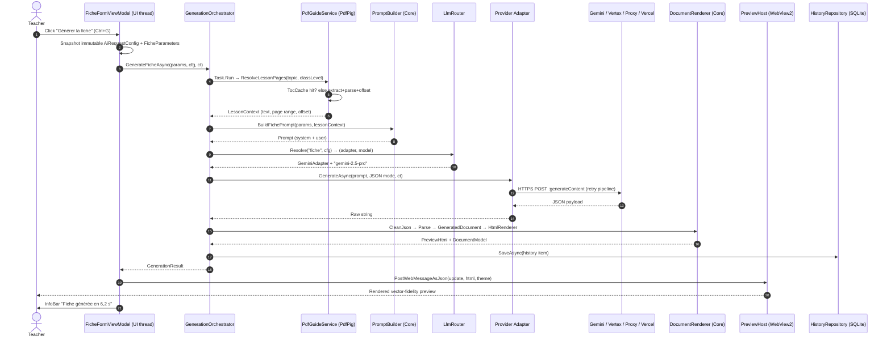
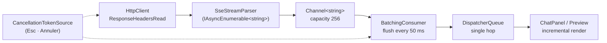

# PROFstudio for Windows — Production Architecture Blueprint

> **Document Status:** Master Architectural Blueprint (v1.0) — Ground-Up Native Windows Re-Engineering
> **Author:** Principal Desktop Software Architect
> **Audience:** Engineering team, reviewers, future maintainers
> **Scope:** Complete technical design for a native Windows 10/11 edition of PROFstudio, achieving full feature parity with the macOS reference while exploiting Windows-native capabilities that have no macOS equivalent.

---

# 1. Executive Summary & Technological Choices

## 1.1 Architectural Vision

PROFstudio for Windows is a **single-window, Fluent Design, WinUI 3 desktop application** targeting French primary/secondary teachers on Windows 10 (1809+) and Windows 11, on **x64 and ARM64**. It is not a port: every subsystem has been re-evaluated against the Windows platform's strengths. Three deliberate architectural upgrades distinguish it from the macOS original:

1. **A canonical intermediate document model.** The macOS app renders LLM JSON → HTML, then round-trips HTML → RTF via `NSAttributedString` (lossy). On Windows we introduce a structured `GeneratedDocument` block schema as the single source of truth, with three renderers (HTML for preview, DOCX via Open XML, RTF via a purpose-built writer). Teachers get a *real Word document*, not an RTF approximation.
2. **A true off-screen vector PDF pipeline.** WebView2's `PrintToPdfAsync` renders and paginates fully off-screen with no hidden-window hacks (the macOS `alphaValue = 0.01` trick is unnecessary — the WebView2 compositor does not require visibility).
3. **Full-text searchable history.** SQLite with FTS5 replaces the flat `history.json`, giving teachers instant search across thousands of generated documents.

Platform-critical constraint discovered during design and addressed throughout: **French teachers operate under RGPD**, and several target providers are US-hosted. The app therefore ships with a first-run data-flow disclosure, telemetry **off by default**, and first-class support for **fully offline operation via a local OpenAI-compatible proxy (Ollama)** — including the MSIX loopback capability (`privateNetworkClientServer`) that packaged Windows apps require to reach `localhost:11434`.

## 1.2 Technology Stack — Decision Table

| Layer | Selection | Rationale (summary) |
| :--- | :--- | :--- |
| **Language / Runtime** | **C# 12 / .NET 8 (LTS)** | First-class Windows toolchain, `async/await` maturity, `IAsyncEnumerable<T>` for token streaming, `System.Threading.Channels` for actor-style pipelines, source-generated JSON, ReadyToRun. Clean upgrade path to .NET 10 LTS. |
| **UI Framework** | **WinUI 3 (Windows App SDK 1.6+)** | Native Fluent 2 visuals (Mica, Acrylic), modern controls (`NavigationView`, `InfoBar`, `TeachingTip`, `Expander`), first-class WebView2, MSIX identity, Windows 11 snap/keyboard/IME integration, active Microsoft investment. |
| **UI Pattern** | **MVVM** via **CommunityToolkit.Mvvm** (source generators) | Zero-reflection `ObservableProperty`/`RelayCommand`, `IMessenger` for decoupled events, industry standard for XAML. |
| **App Host / DI** | **Microsoft.Extensions.Hosting + DI + Options + Logging** | Standardized service lifetimes, configuration binding, testability. |
| **HTTP / Streaming** | **HttpClient (`SocketsHttpHandler`) via `IHttpClientFactory`**, hand-rolled SSE parser, **`IAsyncEnumerable<string>`** token streams | Thread-safe singleton client; SSE is a 150-line spec-compliant parser — no dependency risk. |
| **Resilience** | **Polly v8 (`Polly.Core`) resilience pipelines** | Jittered exponential retry, per-attempt timeouts, `Retry-After` honoring, no hedging on non-idempotent LLM POSTs. |
| **PDF Text Extraction** | **UglyToad.PdfPig** (Apache 2.0, pure managed) | Per-glyph **positional** text (superior to PDFKit for offset heuristics), zero native binaries → trivial ARM64, permissive license. |
| **PDF Thumbnails / Raster** | **`Windows.Data.Pdf`** (WinRT, in-box) | OS-native rasterization for guide thumbnails; no bundled PDFium needed; works on ARM64 day one. |
| **HTML Preview / PDF Export** | **WebView2 (Evergreen)** | Chromium rendering parity with modern CSS, `PrintToPdfAsync` vector PDF **fully off-screen**, native two-way `WebMessage` bridge (no Base64 hack), virtual-host folder mapping for local assets. |
| **Word Export** | **DocumentFormat.OpenXml** (`.docx`) | MIT, no Office dependency, produces genuine Word files — strategically better than RTF round-trip. |
| **RTF Export** | Internal `RtfDocumentWriter` (~600 LOC, from block schema) | RTF spec is stable; our schema is bounded; clipboard `CF_RTF` enables paste-into-Word. |
| **Diff Engine** | **DiffPlex** (Apache 2.0, Myers O(ND)) | Same unified-diff semantics as the macOS DP-LCS, strictly better complexity and battle-tested. |
| **Credential Storage** | **Windows Credential Locker (`PasswordVault`)**, **DPAPI (`ProtectedData`)** fallback | OS-managed per-user secret vault — the direct Keychain analog. DPAPI covers any unpackaged/degraded scenario. |
| **Settings Storage** | Versioned **JSON** at `%LOCALAPPDATA%\FicheGen\settings.json`, atomic write | Transparent, backupable, matches macOS semantics. |
| **History Storage** | **SQLite (`Microsoft.Data.Sqlite`) + FTS5** | Transactional, indexed full-text search, scales to tens of thousands of documents. |
| **Logging** | **Serilog** rolling-file sink | Structured logs, size-capped, teacher-exportable diagnostics bundle. |
| **Testing** | xUnit, FluentAssertions, **Verify.Xunit** (golden files), **WireMock.Net** (provider simulation) | Golden-file tests for prompt builders and renderers; recorded SSE fixtures for adapters. |
| **Packaging** | **Single-project MSIX**, `WindowsAppSDKSelfContained=true`, **`.appinstaller`** auto-update + **WinGet** publication | Clean install/uninstall for school IT; identity unlocks Credential Locker; self-contained WASDK removes a runtime prerequisite. |

## 1.3 Architecture Decision Records (Condensed)

| # | Decision | Rejected Alternatives | Why |
| :--- | :--- | :--- | :--- |
| **ADR-1** | WinUI 3 | WPF + WpfUI, Avalonia | WPF is in maintenance mode (no Mica/Fluent 2 natively, aging render stack); Avalonia is excellent but non-native (no MSIX identity niceties, extra interop for Credential Locker/WebView2). Revisit trigger: if a blocking WinUI 3 defect cannot be worked around at milestone M5, the View layer is replaceable (see §2 layering). |
| **ADR-2** | Packaged MSIX | Unpackaged + Velopack | Credential Locker requires package identity; MSIX gives atomic install/uninstall, clean story for school IT, Store option later. WebView2 and DPAPI work in both modes. |
| **ADR-3** | PdfPig | iText (AGPL/commercial), PDFsharp (weak text layer), Docotic (paid), MuPDF (AGPL/commercial) | Only PdfPig combines permissive license + pure managed code + glyph-level coordinates. |
| **ADR-4** | WebView2 Evergreen | CEF (huge binary, manual updates), wkhtmltopdf (unmaintained), headless Edge automation | Evergreen runtime is preinstalled on Win11 and serviced by Microsoft; bootstrapper covers the residue. Fixed-version WebView2 (~250 MB) rejected — size. |
| **ADR-5** | PasswordVault + DPAPI | Encrypted-file-only, Windows Hello key attestation | Hello adds hardware ceremony with no benefit for API tokens; file-only encryption rolls our own crypto. |
| **ADR-6** | SQLite FTS5 | JSON (macOS parity), LiteDB | FTS5 gives instant relevance-ranked search over full document text; LiteDB's text search is materially weaker. |
| **ADR-7** | DiffPlex (Myers) | Port macOS DP-LCS | Identical output semantics, O(ND) vs O(N·M) memory. |
| **ADR-8** | DOCX as primary "Word" export | HTML→RTF only | Teachers edit in Word; DOCX is the honest deliverable. RTF retained for legacy school software and clipboard paste. |

---

# 2. System Architecture & Component Design

## 2.1 Architectural Pattern

**MVVM over a layered ("Clean-lite") core**, with dependency injection from the composition root and four strict layers:

| Layer | Assembly | May Reference | Contents |
| :--- | :--- | :--- | :--- |
| **Domain / Core** | `FicheGen.Core` | `System.*` only (+ STJ) | Document block schema, prompt builders, prompt templates (embedded resources), ToC parsing heuristics, JSON cleaning, HTML/DOCX-model logic, interfaces for all infrastructure. **100% unit-testable, zero UI, zero I/O.** |
| **Infrastructure** | `FicheGen.Infrastructure` | Core | LLM HTTP client + adapters + router + SSE parser, PdfPig extraction, CredentialStore, SettingsStore, HistoryRepository (SQLite), Docx/Rtf exporters, logging. |
| **Application** | `FicheGen.App/Services` | Core + Infrastructure | Orchestrators that coordinate multi-step use-cases (generation, assistant, export), UI-thread-aware but view-free. |
| **Presentation** | `FicheGen.App` (Views, ViewModels, Controls) | All above via DI | XAML pages, ViewModels, WebView2 hosts, converters, behaviors. |

**Cross-layer rules:**
- ViewModels never touch `HttpClient`, `PdfDocument`, or files — only Application services.
- Infrastructure never touches `DispatcherQueue` or XAML types (the WebView2 exporter is the single deliberate exception and lives in `App` behind the `IDocumentPdfExporter` interface, because `CoreWebView2` is UI-affined).
- Everything crossing a thread boundary is an **immutable record** (the direct analog of the macOS `AIConfig` `Sendable` snapshot).

## 2.2 Component Architecture Diagram

```mermaid
graph TD
    subgraph Presentation["Presentation Layer (WinUI 3 / XAML)"]
        MainWindow["MainWindow (Mica · NavigationView · Custom TitleBar)"]
        FichePage["FichePage"]
        EvalPage["EvaluationPage"]
        QuizPage["QuizPage"]
        HistoryPage["HistoryPage"]
        SettingsPage["SettingsPage"]
        PreviewHost["PreviewHost (WebView2)"]
        AssistantPane["AssistantPane (Chat + Diff)"]
    end

    subgraph VM["ViewModels (CommunityToolkit.Mvvm)"]
        FicheVM["FicheFormViewModel"]
        EvalVM["EvaluationViewModel"]
        QuizVM["QuizViewModel"]
        ResultVM["ResultViewModel"]
        ChatVM["AssistantViewModel"]
        HistVM["HistoryViewModel"]
        PrefVM["SettingsViewModel"]
    end

    subgraph AppSvc["Application Services"]
        Orchestrator["GenerationOrchestrator"]
        AssistantSvc["AssistantService (Intent + Streaming Edit)"]
        ExportSvc["ExportService (PDF/DOCX/RTF/Print)"]
        StyleSvc["StylePresetService"]
    end

    subgraph Infra["Infrastructure Layer"]
        Router["LlmRouter (per-purpose routing)"]
        Adapters["Provider Adapters<br/>Gemini · Vertex · OpenAI-compat · Vercel"]
        Http["IHttpClientFactory + Polly Pipelines"]
        SSE["SseStreamParser"]
        PdfSvc["PdfGuideService (PdfPig)"]
        TocCache["TocCacheStore (JSON)"]
        Creds["CredentialStore (PasswordVault / DPAPI)"]
        Settings["SettingsStore (settings.json)"]
        History["HistoryRepository (SQLite + FTS5)"]
        Docx["DocxExporter (Open XML)"]
        Rtf["RtfExporter"]
        Wv2["WebView2PdfExporter (App layer)"]
    end

    subgraph External["External AI Providers"]
        Gemini["Google Gemini AI Studio"]
        Vertex["Google Cloud Vertex AI"]
        Proxy["OpenAI-Compatible Proxy / Ollama (localhost)"]
        Vercel["Vercel AI SDK Endpoint"]
    end

    FichePage --> FicheVM
    EvalPage --> EvalVM
    QuizPage --> QuizVM
    HistoryPage --> HistVM
    SettingsPage --> PrefVM
    PreviewHost --> ResultVM
    AssistantPane --> ChatVM

    FicheVM --> Orchestrator
    EvalVM --> Orchestrator
    QuizVM --> Orchestrator
    ChatVM --> AssistantSvc
    ResultVM --> ExportSvc
    PrefVM --> Settings
    HistVM --> History

    Orchestrator --> PdfSvc
    Orchestrator --> Router
    AssistantSvc --> Router
    StyleSvc --> Router
    Router --> Adapters
    Adapters --> Http
    Adapters --> SSE
    PdfSvc --> TocCache
    ExportSvc --> Wv2
    ExportSvc --> Docx
    ExportSvc --> Rtf

    Orchestrator --> Settings
    Router --> Creds
    Orchestrator --> History

    Adapters --> Gemini
    Adapters --> Vertex
    Adapters --> Proxy
    Adapters --> Vercel
```



## 2.3 End-to-End Sequence (Fiche Generation)



## 2.4 Concurrency, Async & Data-Flow Model

The macOS design uses `@MainActor` / `actor` / `Task.detached` / `AsyncThrowingStream`. The Windows model maps these onto .NET primitives with **seven hard rules** enforced by analyzers (`Microsoft.VisualStudio.Threading.Analyzers`) and code review:

| # | Rule | Mechanism |
| :--- | :--- | :--- |
| **R1** | All observable state mutates on the UI thread. | `DispatcherQueue` affinity in ViewModels; background continuations use `ConfigureAwait(false)`; re-entry via `dispatcher.TryEnqueue` or `await` captured-context at VM boundary. |
| **R2** | CPU-bound work never runs on the UI thread. | `Task.Run` for PDF extraction, ToC parsing, diff computation, DOCX/RTF rendering. |
| **R3** | No shared mutable state crosses threads. | Immutable records (`AiRequestConfig`, `FicheParameters`, `LessonContext`) snapshotted on the UI thread before any async hop — the exact analog of macOS `AIConfig(from: appState)`. |
| **R4** | The LLM client is stateless & thread-safe (replaces Swift `actor`). | Singleton `ILlmClient` over thread-safe `HttpClient`; all per-call state is a parameter. Where serialization is genuinely needed (settings writes, history writes), use a serialized writer (`SemaphoreSlim(1,1)` / single-writer channel), not an actor. |
| **R5** | Streaming uses bounded back-pressure, UI updates are throttled. | Producer: SSE parser → `Channel<string>` (capacity 256). Consumer: batches chunks every **50 ms** → one dispatcher hop → preview/chat update. Guarantees 60 fps even at token flood rates. |
| **R6** | Everything async is cancellable. | One `CancellationTokenSource` per generation (Esc / Cancel button / navigation away cancels); tokens flow end-to-end into `HttpClient`, `Task.Run`, channel readers, WebView2 export. |
| **R7** | One writer per resource. | `SettingsStore` and `HistoryRepository` serialize writes internally; readers use lock-free snapshots / SQLite WAL mode. |

**Streaming pipeline:**



## 2.5 macOS → Windows Idiom Mapping (Authoritative)

| macOS (reference) | Windows (this design) |
| :--- | :--- |
| SwiftUI views | WinUI 3 XAML pages/controls |
| `@MainActor ObservableObject AppState` | Per-feature ViewModels + `DispatcherQueue` (R1); no god-object — state is sliced by feature with `IMessenger` for cross-VM events |
| `actor GeminiClient` | Stateless singleton `ILlmClient` (R4) |
| `AIConfig` `Sendable` snapshot | `AiRequestConfig` immutable record (R3) |
| `Task.detached(priority: .userInitiated)` | `Task.Run` (R2) |
| `AsyncThrowingStream` | `IAsyncEnumerable<string>` + `Channel<T>` (R5) |
| Combine `@Published` | `CommunityToolkit.Mvvm` source-generated `ObservableProperty` |
| PDFKit (`PDFDocument`, 0-indexed) | PdfPig (`GetPage(n)`, **1-indexed** — aligns with printed page numbers, removing the macOS off-by-one trap; see §8) |
| WKWebView + Base64 JS bridge | WebView2 `PostWebMessageAsJson` + virtual host mapping — no Base64, no CORS issues |
| `WKPDFConfiguration.createPDF()` | `CoreWebView2.PrintToPdfAsync()` — off-screen, no hidden-window alpha hack |
| `NSAttributedString` HTML→RTF | Block-schema → `RtfDocumentWriter` + DOCX via Open XML |
| Keychain (`SecItemAdd`) | `PasswordVault` (Credential Locker) / DPAPI fallback |
| `~/Library/Application Support/...` | `%LOCALAPPDATA%\FicheGen\...` |
| `history.json` | SQLite + FTS5 |
| `NSOpenPanel` / drag-drop | WinRT `FileOpenPicker`/`FolderPicker` (window-handle initialized) / XAML `Drop` events |
| `NSPrintOperation` | WebView2 `ShowPrintUI()` (system print dialog) |

---

# 3. UI / UX System & Windowing Specification

## 3.1 Windowing & Shell

- **Single instance.** Enforced via `AppInstance.GetActivatedEventArgs` + `RedirectActivationTo` on a named mutex; second launch forwards activation (and any file args) to the running window.
- **One main window** (design decision: teachers multitask with Windows Snap; multiple document windows add state complexity without payoff). Default 1440×900, minimum 1024×640. Size/position/maximized state serialized to `settings.json` and restored on launch.
- **Custom title bar:** `ExtendsContentIntoTitleBar = true`; left: app glyph + title + current provider/model chip; right: assistant toggle, settings gear, window controls. Full drag-region handling (`SetTitleBar`), caption-button theming on theme change, Mica backdrop (`MicaBackdrop`) with `DesktopAcrylicBackdrop` fallback on Windows 10.
- **Theming:** follows system by default (`ElementTheme.Default`), explicit Light/Dark override in Settings; system accent color; **High Contrast theme resources provided** (a11y requirement). Document themes (§5.7) style the *generated documents only* — app chrome always uses Fluent, avoiding the classic "theme leaks into UI" bug class.

## 3.2 Navigation & Layout Hierarchy

```text
MainWindow
├── CustomTitleBar
├── NavigationView (PaneDisplayMode: Auto; Left ≥ 1000 px, LeftCompact < 1000 px)
│   ├── FichePage            (📘 Fiche pédagogique)
│   ├── EvaluationPage       (📝 Évaluation)
│   ├── QuizPage             (⚡ Quiz)
│   ├── HistoryPage          (🕘 Historique)
│   └── [Footer] SettingsPage (⚙ Paramètres, Ctrl+,)
└── Content per generator page:
    ├── Column 1: Form panel (ScrollViewer, max-width 480, min 320)
    ├── GridSplitter (draggable, ratio persisted)
    ├── Column 2: PreviewHost (WebView2) + floating CommandBar overlay
    └── Column 3 (toggleable, 360 px): AssistantPane — overlays (not pushes)
        content below 1280 px effective width
```

**Responsive behaviors:** pane auto-collapses to icons < 1000 px; assistant pane becomes overlay < 1280 px; form fields stack; GridSplitter ratio persisted per page in settings.

## 3.3 Component Breakdown

### 3.3.1 Generator Forms (`FichePage` / `EvaluationPage` / `QuizPage`)

- **Shared chrome:** header (title + description), form card, drop zone, generate bar (accent `Button` + `ProgressRing` + elapsed timer + **Annuler** (Esc)), `InfoBar` area for non-blocking errors/warnings.
- **FicheForm fields:** `ComboBox` Niveau (CP → 3e), `ComboBox` Matière, `AutoSuggestBox` Leçon (bound to cached ToC entries, `QuerySubmitted` + free text allowed), `NumberBox` Durée (min, 15–180), multiline `TextBox` Consignes additionnelles, `ToggleSwitch` "Utiliser le guide pédagogique", dashed **PDF drop zone** (`AllowDrop`, `DragOver` sets accent visual state, accepts `.pdf` via `DataPackageView.GetStorageItemsAsync`).
- **EvaluationForm additions:** multi-select lesson picker (`ItemsRepeater` of `CheckBox` from ToC cache) + free-topic chips, `ComboBox` Type (sommative/formative), total points fixed 20 (displayed), difficulty `Slider`.
- **QuizForm additions:** `NumberBox` Questions (3–30), Duration (5–30 min), Difficulty, item-type toggles (QCM, Vrai/Faux, Réponse courte).
- **Validation:** MVVM with `ObservableValidator` — generate button disabled with tooltip reason until valid.

### 3.3.2 Preview Panel (`PreviewHost`)

- WebView2 surface; **floating translucent `CommandBar`** (auto-hides after 3 s idle, reappears on pointer move): Export PDF (Ctrl+Shift+E), Export Word (Ctrl+Shift+W), Export RTF, Copier (HTML + RTF clipboard formats), Imprimer (Ctrl+P → system dialog via `ShowPrintUI()`), zoom (Ctrl+±, persisted), style-preset picker.
- Empty state: branded illustration + "Générez votre première fiche" + TeachingTip on first run.
- Busy state: skeleton shimmer; streaming state: progressive render with subtle pulse.
- Status bar (bottom of window): provider • model • duration of last generation • cancel button while busy.

### 3.3.3 Assistant Pane (`AssistantPane`)

- **Mode selector:** CommunityToolkit `Segmented` control — Auto / Générer / Modifier / Question.
- **Message list:** `ListView` with item templates (user bubble, assistant markdown bubble rendered in a lightweight WebView2-free `TextBlock` rich layout via `CommunityToolkit.Labs` markdown or rendered HTML blocks, streaming cursor, error card with retry).
- **Diff card** (Modifier mode): unified diff rendering — green `+` rows, red `−` rows, collapsed `@@ N lignes inchangées @@` expanders; action bar: **Appliquer** / **Rejeter** / Copier; applying replaces preview content with an undoable action (Ctrl+Z restores previous document — improvement over macOS).
- **Input:** auto-growing `TextBox`, Enter=send / Shift+Enter=newline, send button with streaming-stop morph.

### 3.3.4 Settings (Windows 11-style)

Built from `SettingsCard`/`SettingsExpander` (CommunityToolkit) in five tabs (Pivot or stacked expanders):
- **Général:** thème, langue (fr-FR default), niveau/matière par défaut, dossier de sortie, lancement au démarrage (StartupTask).
- **IA:** provider global, credentials (`PasswordBox` with reveal + "🔒 Securisé sur votre appareil."), **per-purpose routing grid** (rows: Fiche/Évaluation/Quiz/ToC/Offset/Syntaxe/Chat; columns: Provider override, Model override), température sliders, **Tester la connexion** (per provider, with latency + model list echo).
- **Dossiers:** dossier des guides (`FolderPicker` → `FutureAccessList`), cache ToC (open / clear with size), exports.
- **Styles:** preset list, StyleBuilder (colors via `ColorPicker`, font combo, margin `NumberBox`, live mini-preview), **AI Style Generator** (pick sample PDF → generates CSS preset).
- **Avancé:** multi-pass generation toggle, experimental flags, log level, **Exporter le pack de diagnostic** (zip: logs + settings scrubbed of secrets), RGPD consent state, telemetry toggle (default OFF).

### 3.3.5 History Page

- `AutoSuggestBox` search (FTS5-backed, relevance ranked, highlighted matches via converter), filter chips (Tout / Fiches / Évaluations / Quiz / ⭐ Favoris), date-grouped `ListView` (grouped by "Aujourd'hui / Hier / Cette semaine / Plus ancien"), right-side read-only preview, context menu: Ouvrir, Exporter (PDF/DOCX), Favori, Renommer, Supprimer. Retention policy setting (keep forever / 90 days / 30 days) enforced by a background sweep.

## 3.4 Keyboard Map

| Shortcut | Action |
| :--- | :--- |
| Ctrl+G | Générer (current page) |
| Esc | Annuler la génération / fermer le panneau |
| Ctrl+B | Toggle assistant |
| Ctrl+Shift+E / Ctrl+Shift+W | Export PDF / Word |
| Ctrl+P | Imprimer |
| Ctrl+, | Paramètres |
| Ctrl+F | Recherche (Historique) |
| Ctrl+Z | Annuler l'application du diff |
| Ctrl+Tab | Cycle pages |

Implemented as XAML `KeyboardAccelerator`s; discoverable via tooltips.

## 3.5 Accessibility & Localization

- Full `AutomationProperties.Name/HelpText` coverage; generation status is a **live region** (Narrator announces "Génération terminée"); keyboard focus visible; all functionality keyboard-reachable; minimum contrast AA (validated with Accessibility Insights).
- `.resw` resources; **fr-FR** is the shipping default and design language (lengths tested with French strings, which run ~20% longer than English); en-US fallback scaffolded.

---

# 4. Core Subsystems & Native Windows Integration

## 4.A AI Network Client & Routing Engine

### 4.A.1 Components

```text
ILlmClient (singleton, stateless, thread-safe)
├── LlmRouter            → Resolve(purpose, cfg) → ProviderRoute { Adapter, Model, Endpoint, AuthStrategy }
├── IProviderAdapter ×4  → GeminiAdapter · VertexAdapter · OpenAiCompatibleAdapter · VercelAdapter
│     each: BuildRequest / ParseNonStreaming / ParseStreamChunk
├── SseStreamParser      → IAsyncEnumerable<string> data-payloads (spec: multi-line data:, comments, [DONE])
├── ResiliencePipeline   → Polly v8: retry(3, jittered backoff, honor Retry-After) ∘ per-attempt timeout
└── VertexTokenProvider  → service-account OAuth2 (Google.Apis.Auth.OAuth2), token cached 50 min
```

### 4.A.2 Public Contract

```csharp
public sealed record LlmRequest(
    string Purpose,                 // "fiche" | "eval" | "quiz" | "toc" | "offset" | "syntax" | "chat" | "intent" | "style"
    string SystemPrompt,
    string UserPrompt,
    double Temperature,
    bool ResponseJson,
    string? ModelOverride = null);

public interface ILlmClient
{
    Task<string> GenerateAsync(LlmRequest req, AiRequestConfig cfg, CancellationToken ct);

    IAsyncEnumerable<string> GenerateStreamAsync(
        LlmRequest req, AiRequestConfig cfg,
        [EnumeratorCancellation] CancellationToken ct);
}
```

`AiRequestConfig` is the immutable, UI-thread-snapshotted record carrying global provider, per-purpose overrides, base URLs, model names, and **a `Func<string, CancellationToken, ValueTask<string>>` secret resolver** (delegating to `CredentialStore` so raw keys never sit in the snapshot longer than the request build).

### 4.A.3 Routing Resolution (2-tier, parity with macOS)

```text
1. If cfg.RoutingOverrides[purpose] exists → (provider, model?) from override.
2. Else → (cfg.GlobalProvider, cfg.DefaultModel per provider).
3. Model resolution: purpose override model → provider default model → hardcoded fallback.
4. Validate prerequisites (key present, base URL set, Vertex project/region set) →
   else throw LlmConfigurationException → localized InfoBar with deep-link "Ouvrir les paramètres".
```

### 4.A.4 Provider Endpoints & Framing

| Provider | Endpoint | Auth | Streaming |
| :--- | :--- | :--- | :--- |
| Gemini AI Studio | `POST {base}/v1beta/models/{m}:generateContent` / `:streamGenerateContent?alt=sse` | `key=` query or `x-goog-api-key` | SSE `data: {json}` → `candidates[0].content.parts[*].text` |
| Vertex AI | `POST https://{region}-aiplatform.googleapis.com/v1/projects/{p}/locations/{r}/publishers/google/models/{m}:streamGenerateContent` | OAuth2 Bearer (service account) | SSE, same payload shape |
| OpenAI-compatible / Ollama | `POST {baseUrl}/chat/completions` (`stream:true`) | `Authorization: Bearer` (optional for Ollama) | SSE `data: {json}` … `data: [DONE]` |
| Vercel AI SDK | `POST {endpoint}` | Bearer | **Raw text stream** (not SSE) → dedicated `PlainTextStreamParser` |

### 4.A.5 Resilience Policy

| Concern | Policy |
| :--- | :--- |
| Retry | 3 attempts; backoff 1s/2s/4s + 20% jitter; triggers: 408, 429 (honor `Retry-After`), 5xx, `HttpRequestException`, `SocketException`. **Never** retry 400/401/403. |
| Timeout (non-stream) | Per-attempt 60 s, overall 150 s. |
| Timeout (stream) | No overall timeout; **idle watchdog** — cancel if no chunk for 60 s. |
| Circuit breaker | 5 consecutive failures on a provider → 30 s open → fast-fail with actionable message. |
| Hedging | **Disabled** (POSTs to LLMs are non-idempotent and billed). |

### 4.A.6 SSE Parser (sketch)

```csharp
public static async IAsyncEnumerable<string> ReadDataEventsAsync(
    Stream stream, [EnumeratorCancellation] CancellationToken ct)
{
    using var reader = new StreamReader(stream, Encoding.UTF8);
    var data = new StringBuilder();
    while (await reader.ReadLineAsync(ct) is { } line)
    {
        if (line.Length == 0)                       // event boundary
        {
            if (data.Length > 0) { yield return data.ToString(); data.Clear(); }
            continue;
        }
        if (line[0] == ':') continue;               // keep-alive comment
        if (line.StartsWith("data:"))
            data.Append(line.AsSpan(5).TrimStart(' ')).Append('\n');
    }
    if (data.Length > 0) yield return data.ToString();
}
```

### 4.A.7 Error Taxonomy → UX

`LlmException` kinds: `Auth` (401/403 → "Clé invalide — vérifier dans Paramètres"), `RateLimited` (429 persistent → "Quota atteint, réessayez dans N s"), `Network` ("Vérifiez votre connexion"), `Provider` (5xx), `InvalidResponse` (JSON irrécupérable → fallback renderer + warning banner), `Cancelled`. All mapped to localized `InfoBar` messages with a "Copier les détails" button for support.

### 4.A.8 Windows-specific notes

- **Loopback (Ollama):** MSIX-packaged processes cannot reach `localhost` without the `privateNetworkClientServer` capability — declared in the manifest; dev-loopback exemption scripted (`CheckNetIsolation LoopbackExempt`) for unpackaged debugging.
- **Proxy support:** `SocketsHttpHandler` defaults to system proxy — works behind school proxies (`useDefaultCredentials` optional setting).
- **TLS:** .NET 8 defaults (TLS 1.2+/1.3, OS validation) — no custom certificate callbacks, ever.

---

## 4.B PDF Inspection & Text Extraction Engine (PdfPig)

### 4.B.1 Component layout

```text
PdfGuideService (singleton)
├── FindGuideFile(classLevel, guidesDir)        → guide_pedagogique_<niveau>.pdf
├── GetTocAsync(pdfPath)                        → cache-first; Task.Run extraction
├── TocParser (Core, pure)                      → 3-tier regex heuristics over raw text
├── PageOffsetDetector (Core pure logic + PdfPig adapter)
├── ExtractText(pdfPath, physicalPages[])       → string (1-based physical pages)
└── ThumbnailRenderer                           → Windows.Data.Pdf → BitmapImage
```

### 4.B.2 ToC Parsing (tiers, fr-aware)

Input: text of first 12 pages. Normalization: NFC, collapse whitespace, strip accents-insensitive matching kept *only* for keyword detection (titles preserved verbatim).

| Tier | Pattern (conceptual) | Matches |
| :--- | :--- | :--- |
| 1 | `^(title)\s*\.{2,}\s*(\d{1,4})$` | Dot leaders: `Leçon 4 : Les fractions ……… 87` |
| 2 | `^(title)\s{2,}(\d{1,4})$` | Column-separated: `Les aires 132` |
| 3 | `^(\d{1,4})\s*[–\-\.]\s*(title)$` | Leading page: `87 – Les fractions` |

Filters: title length 3–120; reject lines matching `SOMMAIRE|TABLE|PAGE`; dedupe by (title, page); require ≥ 5 entries else next tier; else return null → UI offers manual page entry.

### 4.B.3 Page Offset Detection — the PdfPig advantage

macOS regexes raw page text; **PdfPig gives glyph coordinates**, so we scan only header/footer zones where printed folios live:

```text
for physicalPage in 12..27 (1-based, clamped to pageCount):
    words = page.GetWords()
    candidates = words where word.BoundingBox.Bottom < page.Height * 0.12
                          or word.BoundingBox.Bottom > page.Height * 0.88
    parse candidates: arabic int | roman numeral | "Page N"
    if printed found → delta = physicalPage − printedPage → record
offset = Mode(deltas), require ≥ 3 agreeing samples
confidence = samples / pagesScanned
fallback: whole-page standalone-number scan; final fallback offset = 0 (flagged low-confidence,
          surfaced in UI as "⚠ Offset non détecté — vérifiez les pages")
```

### 4.B.4 ToC cache

- Path: `%LOCALAPPDATA%\FicheGen\cache\toc\{sha256(path+size+mtime)[..16]}.json`
- Schema: `{ "version": 2, "pdfPath", "pdfHash", "generatedUtc", "offset", "offsetConfidence", "entries": [{ "title", "printedPage", "physicalPage" }] }`
- Invalidation: path/size/mtime mismatch → silent rebuild; corrupt file → quarantine + rebuild. Never fails the workflow — worst case is a re-scan (2–4 s for a 400-page guide).
- **Page-range computation:** lesson physical range = `[entry.physicalPage, nextEntry.physicalPage − 1]`, hard-capped at 10 pages (prompt-budget guard), text truncated to ~30k chars with head/tail preservation.

### 4.B.5 Gotchas

- **PdfPig pages are 1-based** (`GetPage(1)` = first page) — this *aligns* with printed folios and eliminates the macOS 0-index trap; document the convention `physicalPage(1-based) = printedPage + offset` in code.
- Scanned guides have **no text layer** → `page.Letters.Count == 0` detection → user-facing warning + manual page override. (Future: `Windows.Media.Ocr` offline French OCR — see §8.)
- Encrypted/permission-restricted PDFs: PdfPig opens most with `ParsingOptions`; failure → actionable error.

---

## 4.C Document Rendering & Export Engine

### 4.C.1 Canonical document model (the architectural upgrade)

```text
GeneratedDocument
├── Metadata { Title, Subtitle, ClassLevel, Subject, Duration, Date, DocType }
├── Blocks[]
│   ├── Heading(level, runs)
│   ├── Paragraph(runs)              runs: Text | Bold | Italic | Underline
│   ├── BulletList(items[])          / NumberedList(items[])
│   ├── Table(header[], rows[][], columnWidths[])   ← barème, QCM matching grids
│   ├── KeyValueGrid(pairs[])        ← student identity block, objectives
│   ├── CalloutBox(kind, blocks[])   ← "Corrigé enseignant", differentiation
│   └── PageBreak
└── SourceJson (original LLM payload, for regeneration/debug)
```

LLM JSON → `GeneratedDocument` (STJ source-generated deserialization) → **three renderers**:

| Renderer | Target | Technology |
| :--- | :--- | :--- |
| `HtmlRenderer` | Preview + PDF export + clipboard | Core, pure string builder; theme CSS injected separately |
| `DocxExporter` | `.docx` | Open XML SDK: styles.xml from preset (fonts/colors), native tables, header/footer with page-number field, A4 + margins (mm→EMU) |
| `RtfDocumentWriter` | `.rtf` + `CF_RTF` clipboard | Internal writer: fonttbl/colortbl from preset, `\fs` sizing, bordered tables, Unicode `\'xx` escaping |

`fallbackMarkdownToHTML` parity retained: if JSON is unrecoverable, a lenient Markdown→blocks converter produces a document with a warning banner block.

### 4.C.2 Preview Host (WebView2)

- `CoreWebView2Environment` with explicit user-data folder under `%LOCALAPPDATA%\FicheGen\WebView2`.
- **Virtual host mapping:** `SetVirtualHostNameToFolderMapping("app.fichegen.local", Assets/Web, Allow)` — shell HTML, `marked.min.js`, theme CSS load over HTTPS-like origin: **zero CORS pain, no Base64 bridge** (macOS gotcha eliminated).
- Content updates: `PostWebMessageAsJson({type:'update', html, theme, zoom})`; JS listener swaps `<article>` innerHTML and re-runs marked/code highlighting if needed.
- Hardening: `AreDefaultContextMenusEnabled=false`, `AreDevToolsEnabled=false` (Release), `IsScriptEnabled=true` (required for marked), strict CSP meta (`default-src 'self' https://app.fichegen.local; style-src 'unsafe-inline'`), navigation blocked to external URLs (`NavigationStarting` → cancel + open in default browser).
- `ProcessFailed` → auto-recreate the WebView once, then InfoBar.
- **CSS sanitizer** for AI-generated themes (§5.7): parse and rebuild against an allowlist (typography, colors, margins, borders; drop `@import`, external `url()`, `position:fixed`, `behavior`, expressions) before injection into preview or PDF.

### 4.C.3 Vector PDF Export (`WebView2PdfExporter`)

```csharp
// Off-screen controller — NO hidden window required (unlike macOS alpha-0.01 hack)
var env   = await CoreWebView2Environment.CreateAsync(userDataFolder: _wv2DataDir);
var ctrl  = await env.CreateCoreWebView2ControllerAsync(_hiddenHostHwnd); // never shown
ctrl.DefaultBackgroundColor = Colors.White;
ctrl.Bounds = new Rect(0, 0, 794, 1123);               // A4 @96dpi
var core  = ctrl.CoreWebView2;

core.SetVirtualHostNameToFolderMapping("app.fichegen.local", _webAssetsDir, Allow);
var readyTcs = new TaskCompletionSource();
core.WebMessageReceived += (s, e) => { if (e.TryGetWebMessageAsString() == "ready") readyTcs.SetResult(); };
core.Navigate("https://app.fichegen.local/print.html");
await readyTcs.Task.WaitAsync(TimeSpan.FromSeconds(10), ct);   // fonts + layout settled

core.PostWebMessageAsJson(updatePayload);                       // html + theme css
await WaitForJsFlagAsync(core, "window.__renderDone === true", ct);

var ps = env.CreatePrintSettings();
ps.Orientation   = PrintOrientation.Portrait;
ps.PageWidth     = 8.27;  ps.PageHeight = 11.69;              // inches (A4)
ps.MarginTop     = MmToIn(preset.MarginMm); /* …all four… */
ps.ShouldPrintBackgrounds = true;
ps.ShouldPrintHeaderAndFooter = false;
ps.ShouldPrintSelectionOnly = false;

await core.PrintToPdfAsync(outputPath, ps);
ctrl.Close();                                                   // dispose deterministically
```

Key guarantees: crisp vector text (Chromium print pipeline), exact CSS fidelity (same engine as preview), cancellation-safe, controller lifetime explicitly managed. Save flow uses `FileSavePicker` (window-handle initialized) with suggested name `Fiche_CP_Fractions_2025-05-14.pdf`.

### 4.C.4 Printing

`core.ShowPrintUI()` (system dialog; reuses the same print shell) — no custom print code, full driver support.

### 4.C.5 Clipboard

`DataPackage` with three formats: `RTF` (CF_RTF bytes), `HTML Format` (CF_HTML with correct `StartHTML:`/`EndHTML:` offset headers — hand-built helper), and plain text. Paste into Word "just works".

---

## 4.D Security & Credentials Management

| Concern | Design |
| :--- | :--- |
| **Primary secret store** | **Windows Credential Locker** (`Windows.Security.Credentials.PasswordVault`), resource `FicheGen`, keys `gemini_api_key`, `proxy_api_key`, `vercel_api_key`, Vertex service-account JSON blob. Per-user, OS-encrypted, ACL'd to the package — the true Keychain analog. |
| **Fallback** | DPAPI `ProtectedData.Protect(plain, entropy, DataProtectionScope.CurrentUser)` → Base64 blob into `settings.json` under `secretsProtected`. Used automatically if Credential Locker is unavailable (unpackaged runs, domain policies). Transparent to callers behind `ICredentialStore`. |
| **Write path** | Settings save extracts any `*_api_key` fields → vault → **strips them from JSON before disk write** (exact parity with macOS `PreferencesStorage.save()` behavior). |
| **Read path** | Lazily resolved per request via the `AiRequestConfig` secret resolver; secrets live as locals for the minimum scope; never stored in ViewModels, logs, telemetry, or history. |
| **Log hygiene** | Serilog destructuring policy redacts `Authorization`, `x-goog-api-key`, `key=`, any 20+ char token-like strings. Diagnostic bundle excludes vault content by construction. |
| **Threat model (summary)** | Protects: at-rest extraction of keys from disk/backup; casual shoulder-surfing (PasswordBox). Does not (and cannot) protect against malware in the user session — documented honestly. |
| **RGPD posture** | First-run disclosure dialog (what leaves the machine, to whom); telemetry off by default; Ollama/offline provider prominently supported for school deployments. |

```csharp
public sealed class CredentialLockerStore : ICredentialStore
{
    private const string Resource = "FicheGen";
    public void Set(string key, string secret)
    {
        var vault = new PasswordVault();
        try { vault.Remove(vault.Retrieve(Resource, key)); } catch { /* not found */ }
        vault.Add(new PasswordCredential(Resource, key, secret));
    }
    public string? Get(string key)
    {
        try { var c = new PasswordVault().Retrieve(Resource, key); c.RetrievePassword(); return c.Password; }
        catch { return _dpapiFallback.Get(key); }
    }
}
```

---

## 4.E Persistence & Local Storage

### 4.E.1 On-disk layout

| Path | Content |
| :--- | :--- |
| `%LOCALAPPDATA%\FicheGen\settings.json` | Non-secret settings (versioned schema) |
| `%LOCALAPPDATA%\FicheGen\history.db` | SQLite (WAL) — history + FTS5 index |
| `%LOCALAPPDATA%\FicheGen\cache\toc\*.json` | ToC caches |
| `%LOCALAPPDATA%\FicheGen\WebView2\` | WebView2 user data |
| `%LOCALAPPDATA%\FicheGen\logs\fichegen-.log` | Serilog rolling (10 MB × 5) |
| `%LOCALAPPDATA%\FicheGen\crash\` | Last-crash report |
| `%USERPROFILE%\Documents\FicheGen\Guides\` | Default guides dir (user-changeable) |
| `%USERPROFILE%\Documents\FicheGen\Exports\` | Default export dir |

### 4.E.2 settings.json (excerpt)

```json
{
  "schemaVersion": 3,
  "ui":   { "theme": "system", "language": "fr-FR", "assistantPaneOpen": true, "splitRatio": 0.38 },
  "defaults": { "classLevel": "CM2", "subject": "Mathématiques", "stylePresetId": "modern" },
  "ai": {
    "globalProvider": "aistudio",
    "models": { "aistudio": "gemini-2.5-pro", "proxy": "qwen2.5" },
    "routingOverrides": { "chat": { "provider": "proxy", "model": "qwen2.5" } },
    "proxyBaseUrl": "http://localhost:11434/v1",
    "vertex": { "project": "", "region": "europe-west1" },
    "temperatures": { "generation": 0.7, "intent": 0.1 }
  },
  "folders": { "guidesDir": "...", "exportsDir": "..." },
  "features": { "expMultiPassGen": false, "telemetry": false, "historyRetentionDays": 0 }
}
```

**Atomic writes:** serialize → write `settings.json.tmp` → flush → `File.Move(tmp, target, overwrite: true)`; corrupt load → rename to `.corrupt-{ts}` + rebuild defaults + InfoBar. Single-writer `SemaphoreSlim` (R7).

### 4.E.3 History schema (SQLite)

```sql
PRAGMA journal_mode = WAL;
CREATE TABLE IF NOT EXISTS history (
    id TEXT PRIMARY KEY,                 -- GUID
    type TEXT NOT NULL,                  -- fiche | evaluation | quiz
    title TEXT NOT NULL,
    class_level TEXT, subject TEXT,
    created_utc TEXT NOT NULL,
    is_favorite INTEGER NOT NULL DEFAULT 0,
    plain_text TEXT NOT NULL,            -- for FTS + list snippets
    html TEXT NOT NULL,                  -- rendered document
    source_json TEXT,                    -- original LLM payload
    style_preset_id TEXT
);
CREATE VIRTUAL TABLE IF NOT EXISTS history_fts USING fts5(
    title, plain_text, content='history', content_rowid='rowid');
-- sync via AFTER INSERT/UPDATE/DELETE triggers
```

Migrations table (`schema_migrations`) with forward-only migration classes; search query uses `MATCH` with prefix terms + `bm25` ranking; 50-row pages.

---

# 5. Feature-by-Feature Technical Specifications

> Common pipeline for §5.1–5.3: `FormViewModel` → snapshot params+cfg → `GenerationOrchestrator` → (optional guide context) → `PromptBuilder` (embedded, versioned French templates with `{placeholders}`) → `ILlmClient` (JSON mode) → `JsonCleaner` (fence-strip, outer-brace extraction, trailing-comma tolerance via STJ options) → `GeneratedDocument` → renderers → preview + history. `JsonException`/unrecoverable → `FallbackMarkdownRenderer` + warning banner. Cancellation checked at every stage boundary.

## 5.1 Fiche Pédagogique Generation

- **Flow:** resolve lesson against ToC cache (title match via normalized Levenshtein ≤ 2 on titles, else free-text topic w/o guide context) → extract lesson pages → build prompt (objectives, phased breakdown teacher/student with minutes, matériel, différenciation, évaluation, prolongement — strict JSON schema, `responseMimeType: application/json` where supported) → parse → `GeneratedDocument` → HTML.
- **Multi-pass (experimental):** if enabled, pass 2 submits rendered HTML with an auto-critique prompt ("améliore la progressivité, vérifie la cohérence des durées"); max 2 passes; each pass cancellable; pass count shown in status bar.
- **Acceptance criteria:** generation with guide → document cites extracted content; without guide → clean degradation; cancel mid-flight leaves no partial state; history entry present within 500 ms of completion.

## 5.2 Évaluation Generation

- Multi-lesson selection merges up to 3 lesson contexts (token-budgeted). Prompt enforces level rules (CP/CE1: matching/fill-blank/short-answer only; cap 20 points; barème sums to 20 — **validated in code** post-parse; if Σ(points) ≠ 20, a normalizer rescales and flags a warning — never trust the model's arithmetic).
- `GeneratedDocument` gains typed blocks: student identity `KeyValueGrid`, `Table` (Barème), `CalloutBox(Corrigé)`.

## 5.3 Quiz Generation

- Parameters validated client-side (3–30 questions, 5–30 min). Parser validates option labels A–D uniqueness; answer-key completeness enforced (missing key item → regenerated once → else flagged in UI). Rendered with answer key in a collapsible corrigé block (print stylesheet keeps it on a separate page via `page-break-before`).

## 5.4 Interactive AI Assistant & Diff Engine

- **Modes:** Auto / Générer / Modifier / Question (Segmented). Auto = intent classification call (temperature 0.1, JSON `{intent, confidence, reasoning}`) with **heuristic fallback** (keyword scoring on "modifie/remplace/traduis/ajoute…") if the classification call fails.
- **Streaming edit (Modifier):** adapter streams revised HTML through the §2.4 channel → progressive preview at 50 ms flushes → on completion, `Task.Run` computes the diff via **DiffPlex** (`InlineDiffBuilder` on lines) → mapped to `DiffLine { Kind: Added|Removed|Unchanged|Collapsed, Text, OldLineNo?, NewLineNo? }` → diff card with unchanged runs of ≥ 4 lines collapsed to `@@ N lignes inchangées @@`. Guard: > 20k lines → skip diff, show "document volumineux" summary.
- **Apply/Reject:** Apply swaps the preview document atomically and pushes the previous document onto an **undo stack** (depth 10) bound to Ctrl+Z — an explicit UX upgrade over macOS. Reject discards. Chat context resets when the underlying document is replaced externally.
- **Question mode:** stateless RAG-lite — the current document text + guide excerpt are injected into the prompt; no document mutation allowed (enforced server-side-of-the-client by dropping any diff output).

## 5.5 Guide & Textbook Inspection UI

- Lesson `AutoSuggestBox` surfaces ToC entries (grouped by unit when detectable), shows `p. {printed}`; subtitle line displays guide file + detected offset + confidence ("Guide CM2 • offset +12 ✓"); low-confidence → warning icon + tooltip + manual "Pages: __–__" override fields (persisted per lesson in settings).
- Drop zone accepts any PDF → bypasses ToC entirely, extracts first-N pages as context.

## 5.6 Export Suite

- PDF (§4.C.3), DOCX, RTF, Copy (3 clipboard formats), Print. Export runs on a background thread except the WebView2 leg (UI-affined) with a modal progress dialog + cancel. All exports embed the active style preset. Naming: `{Type}_{Niveau}_{Slug}_{yyyy-MM-dd}.{ext}`.

## 5.7 AI Style Generator & Preset Builder

- `StylePreset { Id, Name, PrimaryColor, SecondaryColor, FontFamily (system-enum: Segoe UI, Georgia, Times New Roman, Avenir→ fallback cascade), MarginMm, CustomCss? }` — 5 built-ins (Modern, Classic, Minimal, Academic, Playful) as embedded CSS.
- StyleBuilder: `ColorPicker`s, font combo, margin `NumberBox`, **live mini-preview** (second small WebView2 fed with a sample fiche).
- AI generation: sample PDF → PdfPig text (first 3 pages) → prompt "deduce visual identity → pure CSS for the documented selectors" → `JsonCleaner` → **CSS sanitizer allowlist** (§4.C.2) → new preset saved + previewed. (Optional enhancement, flagged v1.1: rasterize 2 pages via `Windows.Data.Pdf` and send to Gemini vision for true visual analysis — the plumbing is provider-adapter-local.)

## 5.8 History Manager

- FTS5 search with `bm25` ranking + prefix matching; filters compose (type + favorites + date group); row context actions; open → rehydrates document + style into preview and resets assistant context (parity); export directly from history; retention sweep at startup (async, throttled); all history I/O off UI thread via repository.

---

# 6. Project Topology, File Structure & Dependencies

## 6.1 Solution Layout

```text
FicheGen.Windows/
├── FicheGen.Windows.sln
├── Directory.Build.props                    # LangVersion 12, Nullable enable, R2R, central versions
├── nuget.config
├── README.md
├── docs/
│   ├── ARCHITECTURE.md                      # this blueprint
│   └── adr/                                 # ADR-001..ADR-008
├── build/
│   ├── ci.yml                               # GitHub Actions
│   ├── sign.ps1                             # AzureSignTool wrapper
│   └── appinstaller.template.xml
├── src/
│   ├── FicheGen.Core/                       # net8.0 (plain), zero UI deps
│   │   ├── Documents/
│   │   │   ├── GeneratedDocument.cs         # block schema + Metadata
│   │   │   ├── HtmlRenderer.cs
│   │   │   ├── FallbackMarkdownRenderer.cs
│   │   │   └── JsonCleaner.cs
│   │   ├── Prompts/
│   │   │   ├── PromptBuilder.cs             # fiche/eval/quiz/toc/offset/syntax/chat/intent/style
│   │   │   └── Templates/*.txt              # embedded French prompt templates (versioned)
│   │   ├── Toc/
│   │   │   ├── TocParser.cs                 # 3-tier regex heuristics
│   │   │   ├── PageOffsetDetector.cs        # pure algorithm over IPageWordSource
│   │   │   └── ToCEntry.cs
│   │   ├── Ai/
│   │   │   ├── AiRequestConfig.cs           # immutable snapshot record
│   │   │   ├── LlmRequest.cs, LlmException.cs, ILlmClient.cs
│   │   │   └── Routing/ProviderRoute.cs
│   │   ├── Diff/DiffLine.cs                 # + mapping helpers (DiffPlex consumed here)
│   │   └── Abstractions/                    # ICredentialStore, ISettingsStore, IHistoryRepository,
│   │                                        # IPdfGuideService, IDocumentPdfExporter, IClock
│   ├── FicheGen.Infrastructure/             # net8.0-windows10.0.19041.0
│   │   ├── Ai/
│   │   │   ├── LlmClient.cs                 # stateless singleton
│   │   │   ├── LlmRouter.cs
│   │   │   ├── SseStreamParser.cs, PlainTextStreamParser.cs
│   │   │   ├── Resilience/ResiliencePipelines.cs
│   │   │   └── Adapters/{GeminiAdapter, VertexAdapter, OpenAiCompatibleAdapter, VercelAdapter}.cs
│   │   ├── Vertex/VertexTokenProvider.cs    # Google.Apis.Auth.OAuth2, cached tokens
│   │   ├── Pdf/
│   │   │   ├── PdfGuideService.cs           # PdfPig adapter, guide resolution, page ranges
│   │   │   ├── PdfPigPageWordSource.cs      # feeds PageOffsetDetector with glyph boxes
│   │   │   ├── TocCacheStore.cs
│   │   │   └── WinRtPdfThumbnailRenderer.cs # Windows.Data.Pdf
│   │   ├── Security/
│   │   │   ├── CredentialLockerStore.cs     # PasswordVault
│   │   │   └── DpapiCredentialStore.cs      # ProtectedData fallback + composition
│   │   ├── Storage/
│   │   │   ├── SettingsStore.cs             # versioned JSON, atomic writes, secret stripping
│   │   │   ├── HistoryRepository.cs         # Microsoft.Data.Sqlite + FTS5 + migrations
│   │   │   └── Migrations/M001_Initial.cs …
│   │   ├── Export/
│   │   │   ├── DocxExporter.cs              # DocumentFormat.OpenXml
│   │   │   ├── RtfDocumentWriter.cs
│   │   │   └── ClipboardPackageBuilder.cs   # CF_HTML/CF_RTF/plain
│   │   └── Diagnostics/SerilogBootstrap.cs, SecretRedactingPolicy.cs
│   └── FicheGen.App/                        # WinUI 3 single-project MSIX
│       ├── Package.appxmanifest             # internetClient, privateNetworkClientServer, StartupTask
│       ├── App.xaml(.cs)                    # Host composition root, global exception handlers
│       ├── MainWindow.xaml(.cs)             # titlebar, Mica, single-instance activation
│       ├── Services/                        # Application layer
│       │   ├── GenerationOrchestrator.cs
│       │   ├── AssistantService.cs          # intent + streaming edit + undo stack
│       │   ├── ExportService.cs
│       │   ├── StylePresetService.cs        # incl. CssSanitizer
│       │   ├── DialogService.cs, PickerService.cs   # window-handle-initialized pickers
│       │   └── WebView2PdfExporter.cs       # IDocumentPdfExporter impl (UI-affined)
│       ├── ViewModels/                      # ShellVM, FicheFormVM, EvaluationVM, QuizVM,
│       │                                    # ResultVM, AssistantVM (+DiffLineVM), HistoryVM,
│       │                                    # SettingsVM, StyleBuilderVM — all source-gen MVVM
│       ├── Views/
│       │   ├── FichePage.xaml, EvaluationPage.xaml, QuizPage.xaml
│       │   ├── HistoryPage.xaml, SettingsPage.xaml, StyleBuilderDialog.xaml
│       │   └── Controls/
│       │       ├── PreviewHost.xaml(.cs)        # WebView2 host + floating CommandBar
│       │       ├── AssistantPane.xaml(.cs)      # Segmented modes, messages, DiffCard
│       │       ├── DiffCard.xaml(.cs)
│       │       ├── GenerateButton.xaml(.cs)     # busy/cancel morph + accelerator
│       │       ├── PdfDropZone.xaml(.cs)
│       │       └── StatusBar.xaml(.cs)
│       ├── Converters/, Behaviors/, Themes/   # HC resources, DiffLineTemplateSelector…
│       ├── Assets/                            # icons, splash, StoreLogo
│       ├── Assets/Web/
│       │   ├── preview.html, print.html         # shells w/ CSP + ready-handshake JS
│       │   ├── marked.min.js
│       │   └── themes/{modern,classic,minimal,academic,playful}.css
│       └── Strings/{fr-FR,en-US}/Resources.resw
└── tests/
    ├── FicheGen.Core.Tests/               # parsers, prompt golden files (Verify), renderers,
    │                                      # JsonCleaner, offset algorithm, diff mapping
    ├── FicheGen.Infrastructure.Tests/     # adapters vs WireMock (SSE, retries, 429/backoff),
    │                                      # settings round-trip + secret stripping,
    │                                      # history FTS queries, DPAPI round-trip
    ├── FicheGen.IntegrationTests/         # fixture PDFs end-to-end (ToC→offset→extract),
    │                                      # WebView2 PDF export smoke (self-hosted runner)
    └── Fixtures/pdfs/…                    # synthetic guides with known ToC/offset ground truth
```

## 6.2 Dependency Manifest (NuGet)

| Package | Ver (floor) | License | Purpose |
| :--- | :--- | :--- | :--- |
| Microsoft.WindowsAppSDK | 1.6.x | MS EULA (redist) | WinUI 3, WebView2, AppInstance |
| Microsoft.Windows.SDK.BuildTools | latest | MS | WinRT projections |
| CommunityToolkit.Mvvm | 8.x | MIT | Source-gen MVVM, IMessenger, validation |
| CommunityToolkit.WinUI.Controls.* | 8.x | MIT | Segmented, SettingsCard/Expander, GridSplitter |
| Microsoft.Extensions.{Hosting,Http,Logging,Options} | 8.x | MIT | DI host, typed HTTP, config |
| Serilog (+Sinks.File) | 4.x | Apache-2.0 | Structured rolling logs |
| Polly.Core | 8.x | BSD-3 | Resilience pipelines |
| UglyToad.PdfPig | 0.1.x | Apache-2.0 | PDF text/glyph extraction |
| DocumentFormat.OpenXml | 3.x | MIT | DOCX export |
| Microsoft.Data.Sqlite | 8.x | MIT | History DB (bundles e_sqlite3, ARM64 included) |
| DiffPlex | 1.7.x | Apache-2.0 | Myers diff |
| Google.Apis.Auth | 1.6x | Apache-2.0 | Vertex service-account OAuth2 |
| Microsoft.VisualStudio.Threading.Analyzers | 17.x | MIT | Async discipline enforcement |
| xunit, FluentAssertions, Verify.Xunit, WireMock.Net | latest | MIT/Apache | Tests |

**MSIX capabilities:** `internetClient`, `privateNetworkClientServer` (Ollama loopback), `startupTask` (opt-in). No `broadFileSystemAccess` — all user folders via pickers + `FutureAccessList`.

**Runtime prerequisites:** WebView2 Evergreen (detected at first run via `GetAvailableCoreWebView2BrowserVersionString`; if absent, branded dialog → silent bootstrapper). WASDK is **self-contained** in the package (ADR: reliability for school IT over ~70 MB size).

---

# 7. Step-by-Step Implementation Guide & Build Roadmap

> Estimates assume one senior engineer, full-time; adjust linearly for team size. Each phase has explicit **exit criteria** — the phase is not done until they pass in CI.

### Phase 0 — Foundations (Week 1)
Repo, `Directory.Build.props`, solution skeleton, CI (windows-latest, `dotnet build` x64/ARM64, unit tests, MSIX packaging, artifact upload), Serilog, DI host in `App.xaml.cs`, global exception capture (AppDomain/TaskScheduler/WinUI `UnhandledException`) → crash writer. **Exit:** "Hello shell" MSIX installs from CI artifact; crash handler proven by a deliberate throw.

### Phase 1 — Shell, Settings, Credentials (Weeks 2–3)
MainWindow (titlebar, Mica, single-instance), NavigationView + page stubs, `SettingsStore` (atomic, versioned, secret-stripping) + `ICredentialStore` (vault + DPAPI fallback), full Settings page IA section UI, theme service, `.resw` scaffolding. **Exit:** secrets survive round-trip and never appear in `settings.json` (unit test); theme/language switch live.

### Phase 2 — AI Client, Routing, Streaming (Weeks 4–5)
`ILlmClient`, 4 adapters, router + overrides, SSE/plain parsers, Polly pipelines, Vertex token provider, channel→throttled-dispatcher streaming demo in a scratch page, WireMock test suite (SSE fixtures, 429/Retry-After, idle-timeout, circuit breaker). **Exit:** streaming from all 4 providers against recorded fixtures; cancel stops network within 100 ms; zero `InvalidOperationException` cross-thread under stress test (10k chunks).

### Phase 3 — PDF Engine (Weeks 6–7)
PdfPig service, ToC parser (3 tiers), offset detector (positional), cache store, guide resolution + page ranges, thumbnail renderer, lesson `AutoSuggestBox` wired to cache, fixture PDFs with ground truth. **Exit:** 100% pass on fixture corpus (5 synthetic publishers); corrupt-cache self-heals; scanned-PDF warning path shown.

### Phase 4 — Generation Pipeline & Preview (Weeks 8–9)
`GeneratedDocument` schema, `HtmlRenderer`, prompt builders + embedded templates, `JsonCleaner` + fallback renderer, `GenerationOrchestrator` (fiche/eval/quiz), PreviewHost (virtual host, message bridge, CSP, zoom, themes), all three forms + validation, status bar. **Exit:** end-to-end fiche from guide PDF to preview on a clean VM; golden-file tests lock renderer output; cancel/Esc honored everywhere.

### Phase 5 — Export Suite (Weeks 10–11)
`WebView2PdfExporter` (off-screen, ready-handshake), `DocxExporter`, `RtfDocumentWriter`, clipboard package builder, `ShowPrintUI` printing, save-pickers + naming, export from preview and history. **Exit:** PDF opens vector-crisp in Edge/Adobe with selectable text; DOCX opens in Word/LibreOffice with correct barème table; RTF pastes into Word via Ctrl+V; print-to-physical-printer smoke pass.

### Phase 6 — Assistant & Diff (Weeks 12–13)
AssistantService (intent + heuristic fallback), streaming edit pipeline, DiffPlex mapping + DiffCard UI, apply/reject + undo stack, question mode with document injection. **Exit:** 5k-line document diffs < 100 ms; apply/undo cycle lossless (round-trip test); intent fallback works with network down.

### Phase 7 — History, Styles, Templates (Week 14)
SQLite repository + FTS5 + migrations, History page (search, filters, groups, context menu), retention sweep, StylePresetService + 5 built-in themes, StyleBuilder + AI style generator + CSS sanitizer, custom prompt-template directory. **Exit:** 10k seeded history rows search < 50 ms; sanitizer blocks `javascript:`/`@import` PoCs.

### Phase 8 — Polish (Weeks 15–16)
Keyboard accelerators complete, TeachingTips/first-run + RGPD disclosure, toasts, drag-drop polish, high-contrast pass + Accessibility Insights validation, French string-length layout audit, perf tuning (R2R, deferred WebView2 init, list virtualization), empty/error states everywhere. **Exit:** AXE/AI scan clean; cold start ≤ 2.5 s on mid-range hardware; UI thread never blocked > 16 ms during generation (ETW/PerfView trace).

### Phase 9 — Packaging, Hardening, Release (Weeks 17–18)
Signed MSIX bundle (x64+ARM64), `.appinstaller` auto-update channel, WinGet manifest PR, WebView2-absent first-run flow, installer dry-runs on Win10 1809/22H2 + Win11 + ARM64 (Parallels/Surface), beta with 10–20 teachers, crash/log triage, v1.0. **Exit:** update from 0.9→1.0 self-installs via appinstaller; zero P1 bugs open; support runbook shipped.

### Testing & Quality Gates (cross-phase)
- **Unit:** Core ≥ 85% line coverage; golden files (Verify) for every prompt and renderer.
- **Integration:** WireMock provider matrix; fixture-PDF corpus; DPAPI/vault round-trips.
- **UI:** FlaUI smoke (launch, generate-with-mock, export) on self-hosted runner with WebView2.
- **Performance budgets:** cold start ≤ 2.5 s; ToC cached load ≤ 50 ms; diff(5k lines) ≤ 100 ms; history search ≤ 50 ms; streaming first-token → paint ≤ 100 ms after network delivery.

### Risk Register (top items)

| Risk | Likelihood | Mitigation |
| :--- | :--- | :--- |
| WinUI 3 blocking defect | Medium | View layer isolated (ADR-1); pin WASDK; WPF re-skin fallback priced at ~3 weeks |
| WebView2 runtime absent (legacy Win10) | Low–Med | First-run detector + silent Evergreen bootstrapper |
| ToC heuristics fail on exotic publishers | Medium | 3 tiers + manual page override UI + telemetry-free "report" button |
| MSIX loopback blocks Ollama | Solved in design | `privateNetworkClientServer` + documented IT exemption |
| LLM JSON drift/hallucination | Medium | JsonCleaner + schema validation + auto-repair pass + fallback renderer |
| School proxy/firewall blocks providers | Medium | System-proxy default; proxy provider for on-prem inference |
| PdfPig font-encoding edge cases (garbled text) | Low | Detect (`Letters.Count`/garble ratio) → warn + manual mode |

---

# 8. Engineering Nuances & Platform Gotchas (Do Not Skip)

1. **PdfPig is 1-indexed; PDFKit was 0-indexed.** `physicalPage = printedPage + offset` holds *directly* with `GetPage(n)`. Keep the invariant comment in `PdfGuideService`; all UI shows printed pages, all extraction uses physical.
2. **No Base64 bridge, ever.** WebView2's `PostWebMessageAsJson` + virtual host mapping make the macOS `atob(decodeURIComponent(escape(...)))` dance unnecessary. Resist copying the pattern.
3. **No hidden-window hack for PDF.** WebView2 renders off-screen; the macOS `alphaValue=0.01` workaround must **not** be ported. But: the controller **must stay alive** until `PrintToPdfAsync` completes — dispose deterministically in `finally`.
4. **MSIX loopback:** reaching `localhost:11434` (Ollama) requires `privateNetworkClientServer` — missing capability fails *silently* at the socket layer. Ship the capability; document for IT.
5. **File pickers need the window handle:** `WinRT.Interop.InitializeWithWindow.Initialize(picker, hwnd)` — forget this and pickers throw on WinUI 3.
6. **`EnsureCoreWebView2Async` before any CoreWebView2 access**; handle `ProcessFailed` (recreate once → InfoBar).
7. **DPAPI blobs are machine+user bound:** settings export/import (backup feature) must exclude `secretsProtected` — keys are re-entered on the new machine.
8. **CF_HTML clipboard format requires byte-offset headers** (`StartHTML:`, `EndHTML:`) — Word silently drops malformed payloads; unit-test against the spec.
9. **STJ source-generation contexts** are mandatory for all DTOs (startup perf + future trimming).
10. **WebView2 user-data folder** must live under app-writable LocalAppData — never Program Files (MSIX install dir is read-only).
11. **Future native lever (v1.1):** `Windows.Media.Ocr` gives offline, French-capable OCR for scanned guides — zero new dependencies, enabling the one macOS gap (text-layer-less PDFs) to be closed natively.

---

# 9. Parity & Upgrade Summary

| Capability | macOS | Windows v1.0 | Note |
| :--- | :--- | :--- | :--- |
| Fiche / Évaluation / Quiz generation | ✅ | ✅ | + barème sum validator, answer-key completeness check |
| 4-provider routing + per-purpose overrides | ✅ | ✅ | + circuit breaker, Retry-After honoring |
| SSE streaming | ✅ | ✅ | + throttled UI pipeline, idle watchdog |
| ToC parsing & offset detection | ✅ | ✅ | **Upgraded:** glyph-position footer/header analysis |
| Vector PDF export | ✅ (WKWebView) | ✅ (WebView2) | **Upgraded:** true off-screen, no window hack |
| RTF export | ✅ | ✅ | **Upgraded:** block-schema writer + DOCX added |
| Assistant + diff | ✅ | ✅ | **Upgraded:** Myers diff + undo stack |
| Style presets + AI style | ✅ | ✅ | **Upgraded:** CSS sanitizer allowlist |
| Keychain secrets | ✅ | ✅ | PasswordVault / DPAPI |
| History | JSON | SQLite FTS5 | **Upgraded:** instant full-text search |
| Offline/privacy mode (Ollama) | partial | ✅ | First-class: loopback capability + proxy routing |
| RGPD posture | implicit | ✅ | Explicit consent, telemetry off, diagnostics bundle |

**Bottom line:** this blueprint delivers a genuinely native Windows application — Fluent/Mica UI, Credential Locker secrets, WebView2 vector PDF, WinRT pickers, MSIX deployment with auto-update — while fixing three structural weaknesses of the original (HTML-centric export, JSON history, regex-only PDF heuristics) and preserving every documented behavior, including all known-risk mitigations. The layering guarantees the two highest-risk dependencies (WinUI 3, LLM providers) are replaceable without touching the domain core.