# PROFstudio — Comprehensive Project Review

> **Reviewed**: 2026-08-06 | **Scope**: Full codebase audit across 6 areas | **Total Issues**: 130+

---

## Executive Summary

PROFstudio has a **clean architectural foundation** — layer boundaries are respected, project references are correct, and Core has zero UI/IO contamination. However, the project has significant issues in **runtime robustness**, **UX polish**, **test coverage**, and **maintainability**. The most urgent problems are:

| Priority | Issue | Impact |
|:---------|:------|:-------|
| 🔴 P0 | PDF export is a stub (writes HTML) | Users get broken files |
| 🔴 P0 | Race conditions in all generation commands | Interleaved/corrupt outputs |
| 🔴 P0 | Test coverage at ~15% Core / ~3% Infrastructure | No safety net for changes |
| 🟠 P1 | MainWindow.xaml.cs god object (1375 lines) | Blocks all feature work |
| 🟠 P1 | SettingsViewModel 64KB + SettingsPage 89KB | Unmaintainable |
| 🟠 P1 | Mutable Dictionary in immutable AppSettings | Thread safety violation |
| 🟠 P1 | No debounce on History search (FTS5 hammered per keystroke) | Performance/DB contention |
| 🟡 P2 | Accessibility gaps across all pages | Exclusion of users with disabilities |
| 🟡 P2 | Missing empty states, loading indicators, confirmations | Confusing UX |

---

## 1. Architecture & Layer Compliance

### ✅ What's Good
- **Core is perfectly clean** — zero UI, IO, or HTTP references
- **Infrastructure has no UI dependencies** — no `DispatcherQueue`, no XAML types
- **Project references** are correct: App → Infrastructure → Core
- **Nullable reference types** enabled globally via `Directory.Build.props`
- **C# 12** language version set globally

### ❌ Issues Found

#### 🔴 Critical / High

| # | File | Category | Description |
|:--|:-----|:---------|:------------|
| A1 | [`AppSettings.cs`](file:///c:/Users/walid/work/goofy-goodall/src/FicheGen.Core/Storage/AppSettings.cs) | Thread Safety | `Dictionary<string, string> SecretsProtected` is **mutable** inside an otherwise-immutable record. Any code holding a reference can mutate it across threads. **Fix**: Use `ImmutableDictionary<string, string>`. |
| A2 | [`ResultViewModel.cs`](file:///c:/Users/walid/work/goofy-goodall/src/FicheGen.App/ViewModels/ResultViewModel.cs) | Layer Violation | Direct `File.WriteAllTextAsync()` call — ViewModels must not touch the filesystem. **Fix**: Move to an `IExportService` in Infrastructure. |
| A2b | [`SettingsViewModel.cs`](file:///c:/Users/walid/work/goofy-goodall/src/FicheGen.App/ViewModels/SettingsViewModel.cs) L12-14, L791-886, L986-1024 | Layer Violation | Uses `Windows.Storage` and `Windows.Storage.AccessCache`. `ScanProxyModelsAsync` directly instantiates `HttpClient`. Cache management uses `Directory`/`File` APIs. VMs must NEVER touch HttpClient, files, or storage. **Fix**: Move to `IProxyModelService` and `ICacheService`. |
| A2c | [`GeneratedDocument.cs`](file:///c:/Users/walid/work/goofy-goodall/src/FicheGen.Core/Documents/GeneratedDocument.cs) L25-74 | Thread Safety | `GeneratedDocument` and block types use mutable `List<Block>`, `List<TextRun>`, `List<string>`. Crosses thread boundaries. **Fix**: Use `IReadOnlyList<T>` or `ImmutableArray<T>`. |

#### 🟠 Medium

| # | File | Category | Description |
|:--|:-----|:---------|:------------|
| A3 | [`HistoryViewModel.cs`](file:///c:/Users/walid/work/goofy-goodall/src/FicheGen.App/ViewModels/HistoryViewModel.cs) | Thread Safety | `ObservableCollection` modified from background thread → `InvalidOperationException`. **Fix**: Marshal to UI thread via `DispatcherQueue.TryEnqueue`. |
| A4 | [`SettingsViewModel.cs`](file:///c:/Users/walid/work/goofy-goodall/src/FicheGen.App/ViewModels/SettingsViewModel.cs) | Thread Safety | Properties set from background thread raise `PropertyChanged` off UI thread. **Fix**: Load settings on UI thread or dispatch property sets. |
| A5 | [`AssistantViewModel.cs`](file:///c:/Users/walid/work/goofy-goodall/src/FicheGen.App/ViewModels/AssistantViewModel.cs) | Thread Safety | Chat message collection updated during streaming from background task. **Fix**: Marshal collection updates to UI thread. |
| A6 | Multiple Infrastructure files | Convention | Inconsistent `ConfigureAwait(false)` — many `await` calls missing it in `HistoryRepository`, `SettingsStore`, `LlmClient`. |
| A7 | Multiple files | Convention | Missing `CancellationToken` propagation in `HistoryRepository`, `SettingsStore`, `PdfGuideService` async methods. |
| A8 | [`LlmRouter.cs`](file:///c:/Users/walid/work/goofy-goodall/src/FicheGen.Infrastructure/Ai/LlmRouter.cs) | Nullable | `RouteSelection.ApiKey` is non-nullable `string` but Ollama has no API key. Passing empty string is a code smell. |

#### 🟢 Low

| # | Category | Description |
|:--|:---------|:------------|
| A9 | Convention | 6+ classes missing `sealed` keyword: `LlmException`, `HistoryRepository`, `SettingsStore`, `PdfGuideService`, `CredentialLockerStore`, adapters. |

---

## 2. ViewModel Logic & MVVM

### ❌ Issues Found

#### 🔴 Critical / High

| # | File | Category | Description |
|:--|:-----|:---------|:------------|
| V1 | All generating VMs | Race Condition | **No command disabling during active generation.** User can spam "Generate" and get interleaved/corrupt results. **Fix**: `[RelayCommand(CanExecute = ...)]` with `_isGenerating` flag. |
| V2 | All generating VMs | Cancellation | **No cancel-previous pattern.** Starting a new generation doesn't cancel the old one — they run concurrently. **Fix**: Cancel old `CancellationTokenSource` before creating new one. |
| V3 | [`AssistantViewModel.cs`](file:///c:/Users/walid/work/goofy-goodall/src/FicheGen.App/ViewModels/AssistantViewModel.cs) | Memory Leak | Messages accumulate in unbounded `ObservableCollection`. Long sessions → OOM. **Fix**: Cap at ~100 messages, archive older. |
| V4 | [`FicheFormViewModel.cs`](file:///c:/Users/walid/work/goofy-goodall/src/FicheGen.App/ViewModels/FicheFormViewModel.cs) | Bug | `PageRangeStart > PageRangeEnd` not validated. PDF extraction fails with confusing error. **Fix**: Cross-field validation. |
| V5 | [`FicheFormViewModel.cs`](file:///c:/Users/walid/work/goofy-goodall/src/FicheGen.App/ViewModels/FicheFormViewModel.cs) | Bug | Generate enabled when no PDF is loaded → potential `NullReferenceException`. **Fix**: `CanExecute` guard. |
| V6 | [`HistoryViewModel.cs`](file:///c:/Users/walid/work/goofy-goodall/src/FicheGen.App/ViewModels/HistoryViewModel.cs) | Performance | Search on every keystroke with no debounce → hammers SQLite FTS5. **Fix**: 300ms debounce timer. |
| V7 | [`SettingsViewModel.cs`](file:///c:/Users/walid/work/goofy-goodall/src/FicheGen.App/ViewModels/SettingsViewModel.cs) | Maintainability | **64KB ViewModel** — must be decomposed into 8 partial classes (Providers, Models, Appearance, Export, PdfGuide, Credentials, Prompts, DataManagement). |
| V8 | [`QuizViewModel.cs`](file:///c:/Users/walid/work/goofy-goodall/src/FicheGen.App/ViewModels/QuizViewModel.cs) | Validation | `QuestionCount` has no upper bound → user can enter 1000, causing timeout. **Fix**: Max 50. |
| V9 | All generating VMs | Error Handling | `OperationCanceledException` caught by broad `catch(Exception)` and treated as error instead of normal cancellation flow. **Fix**: Separate catch block. |
| V9b | [`ResultViewModel.cs`](file:///c:/Users/walid/work/goofy-goodall/src/FicheGen.App/ViewModels/ResultViewModel.cs) L430-440 | Bug | **Undo/Redo snapshots save references, not copies.** `PushSnapshot` stores a reference to `CurrentDocument`. If the document is mutated in-place (e.g., by `StreamEditAsync`), Ctrl+Z restores the same mutated state. **Fix**: Deep-clone via JSON serialize/deserialize. |
| V9c | [`AssistantViewModel.cs`](file:///c:/Users/walid/work/goofy-goodall/src/FicheGen.App/ViewModels/AssistantViewModel.cs) L202-224 | Memory Leak | Subscribes to `_resultViewModel.PropertyChanged` with lambda but never unsubscribes. Multiple VM instances → accumulating handlers. **Fix**: `IDisposable` + unsubscribe. |
| V9d | Evaluation/Fiche/Quiz VMs | Memory Leak | `DispatcherQueueTimer` instances (`_draftTimer`, `_elapsedTimer`) created but never stopped or disposed. **Fix**: `IDisposable` + `.Stop()`. |

#### 🟠 Medium

| # | File | Category | Description |
|:--|:-----|:---------|:------------|
| V10 | All VMs | Pattern | No common `ViewModelBase` with `IsLoading`, `ErrorMessage`, `HasError`. Each VM reinvents these. |
| V11 | All VMs | Disposal | No VM implements `IDisposable`. CancellationTokenSources, event subs never cleaned up. |
| V12 | [`AssistantViewModel.cs`](file:///c:/Users/walid/work/goofy-goodall/src/FicheGen.App/ViewModels/AssistantViewModel.cs) | UX | No user-facing "Stop generating" button. Cancellation not exposed. |
| V13 | [`AssistantViewModel.cs`](file:///c:/Users/walid/work/goofy-goodall/src/FicheGen.App/ViewModels/AssistantViewModel.cs) | UX | No LLM context window management — all messages sent as context → will exceed limits. |
| V14 | [`HistoryViewModel.cs`](file:///c:/Users/walid/work/goofy-goodall/src/FicheGen.App/ViewModels/HistoryViewModel.cs) | Bug | Delete removes from `ObservableCollection` before DB delete completes. DB failure → UI out of sync. |
| V15 | [`FicheFormViewModel.cs`](file:///c:/Users/walid/work/goofy-goodall/src/FicheGen.App/ViewModels/FicheFormViewModel.cs) | State | Changing PDF doesn't reset page range values — old range may be invalid for new PDF. |
| V16 | [`SettingsViewModel.cs`](file:///c:/Users/walid/work/goofy-goodall/src/FicheGen.App/ViewModels/SettingsViewModel.cs) | Performance | `On[Property]Changed` triggers saves on every property change. Rapid changes (slider) → many disk writes. **Fix**: Debounce saves. |
| V17 | [`ResultViewModel.cs`](file:///c:/Users/walid/work/goofy-goodall/src/FicheGen.App/ViewModels/ResultViewModel.cs) | UX | No "Open file" / "Open folder" after export. No specific error messages for disk-full/permission-denied. |
| V18 | Cross-VM | Navigation | VMs don't communicate. Generating on FichePage doesn't notify ResultVM. **Fix**: `WeakReferenceMessenger`. |

---

## 3. UI/UX & XAML

### ❌ Issues Found

#### 🔴 Critical / High

| # | File | Category | Description |
|:--|:-----|:---------|:------------|
| U1 | [`MainWindow.xaml.cs`](file:///c:/Users/walid/work/goofy-goodall/src/FicheGen.App/MainWindow.xaml.cs) | **Known Issue #2** | **1375-line god object.** Must decompose into: `NavigationService`, `WebView2Manager`, `AssistantPanelHelper`, `PreviewService`, `ThemeService`, `NotificationService`, and partial classes for lifecycle/input/drag-drop. |
| U2 | [`MainWindow.xaml.cs`](file:///c:/Users/walid/work/goofy-goodall/src/FicheGen.App/MainWindow.xaml.cs) L448-449 | **Known Issue #4** | `ToggleAssistantVisibility(bool)` has **empty body**. Button does nothing → destroys user trust. |
| U3 | [`MainWindow.xaml.cs`](file:///c:/Users/walid/work/goofy-goodall/src/FicheGen.App/MainWindow.xaml.cs) L142-293 | **Known Issue #5** | Duplicate navigation logic in `OnMainWindowLoaded` and `OnMainWindowActivated` → double navigation on first launch. |
| U4 | [`MainWindow.xaml.cs`](file:///c:/Users/walid/work/goofy-goodall/src/FicheGen.App/MainWindow.xaml.cs) L1133-1172 | **Known Issue #6** | `TryExecuteCommand`/`TryInvokeMethod` use **reflection** for command dispatching. Not type-safe, not discoverable. **Fix**: Replace with `WeakReferenceMessenger`. |
| U5 | [`SettingsPage.xaml`](file:///c:/Users/walid/work/goofy-goodall/src/FicheGen.App/Views/SettingsPage.xaml) | Maintainability | **89KB XAML file** — virtually unmaintainable. All tabs physically in DOM, toggling `Visibility="Collapsed"` → massive init overhead. **Fix**: Split into `UserControl`s with `x:Load` deferred loading. |
| U6 | [`SettingsPage.xaml`](file:///c:/Users/walid/work/goofy-goodall/src/FicheGen.App/Views/SettingsPage.xaml) | Security | **API keys shown in plain TextBox.** Use `PasswordBox` with show/hide toggle. |
| U6b | [`FichePage.xaml`](file:///c:/Users/walid/work/goofy-goodall/src/FicheGen.App/Views/FichePage.xaml) | Performance | Uses classic `{Binding}` instead of compiled `{x:Bind}`. Relies on runtime reflection, slower, incompatible with NativeAOT. **Fix**: Add `x:DataType` and use `{x:Bind}`. |
| U6c | [`FichePage.xaml.cs`](file:///c:/Users/walid/work/goofy-goodall/src/FicheGen.App/Views/FichePage.xaml.cs) L323-382 | Bug | `ValidateForm()` manually sets `GenButton.IsEnabled = false`, conflicting with `ICommand.CanExecute`. `MoveAssistantTo` physically reparents XAML elements between containers — can cause WinUI layout crashes. |

#### 🟠 Medium

| # | File | Category | Description |
|:--|:-----|:---------|:------------|
| U7 | All pages | Accessibility | Missing `AutomationProperties.Name` and `Header` on most interactive controls. Screen readers can't identify inputs. |
| U8 | All pages | UX | **No empty states.** First launch: history page is blank, no guidance. **Fix**: "Vous n'avez pas encore créé de documents" + CTA. |
| U9 | All pages | UX | **No loading indicators** during generation or page navigation. User doesn't know if app is working. |
| U10 | History, Delete actions | UX | **No confirmation dialogs** for destructive actions (delete history, overwrite result). |
| U11 | Settings | UX | **No "Test Connection" button** for API providers. Users discover misconfiguration only at generation time. |
| U12 | [`FichePage.xaml`](file:///c:/Users/walid/work/goofy-goodall/src/FicheGen.App/Views/FichePage.xaml) | UX | Page number inputs are plain `TextBox` — allow non-numeric input. **Fix**: Use `NumberBox`. |
| U13 | [`FichePage.xaml`](file:///c:/Users/walid/work/goofy-goodall/src/FicheGen.App/Views/FichePage.xaml) | UX | No visual validation feedback. Required fields have no `*` indicator, no inline errors. |
| U14 | Code-behind files | Maintainability | `FichePage.xaml.cs` (16KB) and `EvaluationPage.xaml.cs` (16KB) contain logic that belongs in ViewModels. |
| U15 | [`MainWindow.xaml.cs`](file:///c:/Users/walid/work/goofy-goodall/src/FicheGen.App/MainWindow.xaml.cs) | Memory | Event subscriptions in `OnMainWindowLoaded` without corresponding unsubscriptions. |
| U16 | [`MainWindow.xaml.cs`](file:///c:/Users/walid/work/goofy-goodall/src/FicheGen.App/MainWindow.xaml.cs) | Thread Safety | Some `CoreWebView2` accesses without null-check after `EnsureCoreWebView2Async`. |
| U17 | [`AssistantPanel.xaml`](file:///c:/Users/walid/work/goofy-goodall/src/FicheGen.App/Views/Controls/AssistantPanel.xaml) | UX | No typing/thinking indicator while AI processes. No character limit indicator. |
| U18 | [`App.xaml.cs`](file:///c:/Users/walid/work/goofy-goodall/src/FicheGen.App/App.xaml.cs) | Architecture | No DI container — services created manually. Hinders testability at 7+ VMs and 10+ services. |
| U19 | Forms | UX | No draft saving. Navigating away from partially-filled form loses all input. |
| U20 | Settings | UX | Settings changes may not be saved on navigation away. No "Unsaved changes" prompt. |

---

## 4. LLM Integration Layer

### ❌ Issues Found

#### 🔴 Critical / High

| # | File | Category | Description |
|:--|:-----|:---------|:------------|
| L1 | [`LlmClient.cs`](file:///c:/Users/walid/work/goofy-goodall/src/FicheGen.Infrastructure/Ai/LlmClient.cs) L72-76 | **Streaming Has No Resilience** | `GenerateStreamAsync` creates a resilience pipeline but **never executes it**. `_httpClient.SendAsync` is called directly outside the pipeline. Streaming requests have **zero retry, circuit breaker, or timeout**. **Fix**: Wrap `SendAsync` inside `pipeline.ExecuteAsync(...)`. |
| L2 | [`OpenAiCompatibleAdapter.cs`](file:///c:/Users/walid/work/goofy-goodall/src/FicheGen.Infrastructure/Ai/Adapters/OpenAiCompatibleAdapter.cs) L17,37 | **Non-Streaming Broken** | `BuildRequest` checks if URL contains `/chat/completions` to set `stream: true`. ALL OpenAI-compatible endpoints match → **non-streaming calls get SSE responses** → `ParseResponseAsync` crashes with `JsonException`. **Fix**: Pass streaming flag explicitly instead of URL inspection. |
| L3 | [`LlmRouter.cs`](file:///c:/Users/walid/work/goofy-goodall/src/FicheGen.Infrastructure/Ai/LlmRouter.cs) L83 | **Vertex Streaming Broken** | Vertex AI `streamGenerateContent` requires `?alt=sse` query param. Missing → Vertex returns raw JSON array → `SseStreamParser` fails → empty/corrupted output. **Fix**: Append `?alt=sse` to endpoint. |
| L4 | All 4 Adapters (`ParseStreamAsync`) | **Stream Errors Become AI Output** | `ParseStreamAsync` reads the response stream **without checking HTTP status**. 401/429/500 error responses (JSON/HTML) are parsed and **yielded to the UI as generated text**. **Fix**: Check `IsSuccessStatusCode` before streaming. |
| L5 | [`PlainTextStreamParser.cs`](file:///c:/Users/walid/work/goofy-goodall/src/FicheGen.Infrastructure/Ai/PlainTextStreamParser.cs) L12-25 | **UTF-8 Corruption** | Calls `Encoding.UTF8.GetString(buffer, 0, bytesRead)` on raw 4KB chunks. Multi-byte French characters (é, è, ç) spanning chunk boundaries → `\uFFFD` replacement chars. **Fix**: Use `StreamReader` or `UTF8.GetDecoder()` with state. |
| L6 | [`LlmClient.cs`](file:///c:/Users/walid/work/goofy-goodall/src/FicheGen.Infrastructure/Ai/LlmClient.cs) | Resource Leak | Possible `HttpClient` creation per request → **socket exhaustion**. **Fix**: Use `IHttpClientFactory`. |
| L7 | [`StreamingChannelPipeline.cs`](file:///c:/Users/walid/work/goofy-goodall/src/FicheGen.Infrastructure/Ai/StreamingChannelPipeline.cs) | Deadlock | If producer task throws without calling `channel.Writer.Complete(ex)`, consumer hangs forever. **Fix**: `try/finally { writer.Complete(exception); }` |

#### 🟠 Medium

| # | File | Category | Description |
|:--|:-----|:---------|:------------|
| L8 | [`StreamingChannelPipeline.cs`](file:///c:/Users/walid/work/goofy-goodall/src/FicheGen.Infrastructure/Ai/StreamingChannelPipeline.cs) L40-60 | Throttle Bypass | `BatchThrottledAsync` unconditionally yields after `TryRead` returns false, bypassing the 50ms flush interval. Each token triggers a flush → defeats batching purpose. **Fix**: Check `now - lastFlush >= flushInterval` before yielding. |
| L9 | [`LlmRouter.cs`](file:///c:/Users/walid/work/goofy-goodall/src/FicheGen.Infrastructure/Ai/LlmRouter.cs) L8-38 | Ignored Override | `LlmRequest.ModelOverride` property exists but is **never passed to `Resolve`**. Per-request model overrides are non-functional. |
| L10 | [`LlmRouter.cs`](file:///c:/Users/walid/work/goofy-goodall/src/FicheGen.Infrastructure/Ai/LlmRouter.cs) L30,44-54 | Config Lookup | `DefaultModels` dictionary lookup uses raw unnormalized provider string (e.g., `"aistudio"`) but dictionary may use `"gemini"` → lookup fails → falls back to hardcoded defaults. |
| L11 | [`ResiliencePipelines.cs`](file:///c:/Users/walid/work/goofy-goodall/src/FicheGen.Infrastructure/Ai/Resilience/ResiliencePipelines.cs) L18-78 | Pipeline Order | Circuit breaker added *after* retry. Should be *before* so open circuits fail fast at pipeline entry instead of being retried. |
| L12 | All Adapters `EnsureSuccess` | Retry-After | Only checks `RetryAfter?.Delta`. HTTP date format `Retry-After` (e.g., `Wed, 21 Oct 2025 07:28:00 GMT`) is ignored. **Fix**: Also check `.Date` and compute delta. |
| L13 | [`AiRequestConfig.cs`](file:///c:/Users/walid/work/goofy-goodall/src/FicheGen.Core/Ai/AiRequestConfig.cs) + [`RouteSelection.cs`](file:///c:/Users/walid/work/goofy-goodall/src/FicheGen.Core/Ai/Routing/RouteSelection.cs) | Security | **API keys leak via record `ToString()`**. Records auto-generate `ToString()` including all properties. **Fix**: Override `ToString()` to redact. |
| L14 | [`SseStreamParser.cs`](file:///c:/Users/walid/work/goofy-goodall/src/FicheGen.Infrastructure/Ai/SseStreamParser.cs) | SSE Spec | Only handles `data: ` (with space). `data:hello` (no space) is silently dropped. |
| L15 | GeminiAdapter + VertexAdapter | Safety | `finishReason == "SAFETY"` returns empty string with no error. User sees blank output. **Fix**: Throw `LlmException` with message about content safety. |
| L16 | [`VercelAdapter.cs`](file:///c:/Users/walid/work/goofy-goodall/src/FicheGen.Infrastructure/Ai/Adapters/VercelAdapter.cs) L22-27 | Incomplete | Ignores `route.Model` and `req.ResponseJson` — unlike other adapters. |
| L17 | [`LlmRequest.cs`](file:///c:/Users/walid/work/goofy-goodall/src/FicheGen.Core/Ai/LlmRequest.cs) | Validation | No bounds on `Temperature` (0.0–2.0) or `MaxTokens` (> 0). |
| L18 | Resilience | UX | Retry state not surfaced to user. 14s of silent retries. |

---

## 5. Storage, PDF, Export & Security

### ❌ Issues Found

#### 🔴 Critical / High

| # | File | Category | Description |
|:--|:-----|:---------|:------------|
| S1 | [`WebView2PdfExporter.cs`](file:///c:/Users/walid/work/goofy-goodall/src/FicheGen.App/Services/WebView2PdfExporter.cs) | **Known Issue #1** | **STUB — writes raw HTML with `.pdf` extension.** Users get broken files. **Fix**: Implement `CoreWebView2.PrintToPdfAsync()` per Blueprint §4.C.3. |
| S2 | [`SettingsStore.cs`](file:///c:/Users/walid/work/goofy-goodall/src/FicheGen.Infrastructure/Storage/SettingsStore.cs) | Data Loss | **No atomic write.** Crash during `settings.json` write → corrupted file → all settings lost. **Fix**: Write to temp file, then `File.Move` with overwrite. |
| S3 | [`HistoryRepository.cs`](file:///c:/Users/walid/work/goofy-goodall/src/FicheGen.Infrastructure/Storage/HistoryRepository.cs) | Security | Unverified SQL parameterization. If any queries use string interpolation with user search input → SQL injection (can corrupt data even in local SQLite). |
| S4 | [`HistoryRepository.cs`](file:///c:/Users/walid/work/goofy-goodall/src/FicheGen.Infrastructure/Storage/HistoryRepository.cs) | Concurrency | WAL mode handles reader/writer, but **multiple writers still block**. No `SQLITE_BUSY` retry logic. **Fix**: Add retry or serialize writes. |
| S5 | [`DpapiCredentialStore.cs`](file:///c:/Users/walid/work/goofy-goodall/src/FicheGen.Infrastructure/Security/DpapiCredentialStore.cs) | Robustness | DPAPI blobs are machine+user bound. Copying settings to another machine → `CryptographicException` crash. **Fix**: Catch, clear corrupted secrets, prompt re-entry. |
| S6 | [`PdfGuideService.cs`](file:///c:/Users/walid/work/goofy-goodall/src/FicheGen.Infrastructure/Pdf/PdfGuideService.cs) | Memory | PdfPig loads entire PDF into memory. French textbooks can be 50-200MB → `OutOfMemoryException`. **Fix**: Process pages lazily or in batches. |
| S7 | [`ClipboardExporter.cs`](file:///c:/Users/walid/work/goofy-goodall/src/FicheGen.Infrastructure/Export/ClipboardExporter.cs) | Bug | CF_HTML byte offsets must be calculated on **UTF-8 byte length**, not string length. French characters (é, ê, ç) are multi-byte. Wrong calculation → Word silently drops paste. |

#### 🟠 Medium

| # | File | Category | Description |
|:--|:-----|:---------|:------------|
| S8 | [`HistoryRepository.cs`](file:///c:/Users/walid/work/goofy-goodall/src/FicheGen.Infrastructure/Storage/HistoryRepository.cs) | Migration | No schema versioning (`PRAGMA user_version`). Schema changes in updates → database won't open. |
| S9 | [`PdfGuideService.cs`](file:///c:/Users/walid/work/goofy-goodall/src/FicheGen.Infrastructure/Pdf/PdfGuideService.cs) | UX | Scanned (image-only) PDFs return empty text with no explanation. **Fix**: Detect and show "Ce PDF nécessite un OCR". |
| S10 | [`PdfGuideService.cs`](file:///c:/Users/walid/work/goofy-goodall/src/FicheGen.Infrastructure/Pdf/PdfGuideService.cs) | Encoding | French ligatures (œ, æ) and special quotes (« ») may not extract correctly depending on PDF encoding. |
| S11 | [`SettingsStore.cs`](file:///c:/Users/walid/work/goofy-goodall/src/FicheGen.Infrastructure/Storage/SettingsStore.cs) | Concurrency | Multiple reads/writes from different app parts can race. Settings change in SettingsVM while background generation reads. |
| S12 | [`CredentialLockerStore.cs`](file:///c:/Users/walid/work/goofy-goodall/src/FicheGen.Infrastructure/Security/CredentialLockerStore.cs) | Availability | `PasswordVault` not available in all environments (Windows Server, some enterprise). Fallback must be seamless. |
| S13 | [`SecretRedactingPolicy.cs`](file:///c:/Users/walid/work/goofy-goodall/src/FicheGen.Infrastructure/Diagnostics/SecretRedactingPolicy.cs) | Coverage | New API key fields could be added but not added to redaction list → secret leak in logs. **Fix**: Test that all secret properties are redacted. |
| S14 | [`TocParser.cs`](file:///c:/Users/walid/work/goofy-goodall/src/FicheGen.Core/Toc/TocParser.cs) | Edge Case | Multi-line ToC titles (wrapping) split into two entries. Roman numeral pages (i, ii, iii) don't match `\d+`. Page ranges (`12-15`) only capture first number. |
| S15 | [`HistoryEntry.cs`](file:///c:/Users/walid/work/goofy-goodall/src/FicheGen.Core/Storage/HistoryEntry.cs) | Performance | `Content` and `HtmlPreview` loaded as full strings for all entries. History list with many entries → high memory. **Fix**: Lazy load content. |

---

## 6. Test Coverage

### 📊 Coverage Estimate

| Layer | Current Estimate | Target | Status |
|:------|:----------------|:-------|:-------|
| **FicheGen.Core** | ~55-60% | ≥85% | ⚠️ **Below target** |
| **FicheGen.Infrastructure** | ~30-40% | — | ⚠️ **Moderate but gaps in critical paths** |

### ✅ What Exists & Works Well
- **21 test files total** (9 Core, 12 Infrastructure)
- **FluentAssertions** used in most files ✅
- No flaky test patterns ✅
- Proper async patterns ✅
- WireMock.Net used for adapter HTTP tests ✅
- Proper `IDisposable` cleanup in `HistoryRepositoryTests` and `SettingsStoreTests` ✅

### ⚠️ Convention Issues
- **3 files use xUnit `Assert` instead of FluentAssertions**: `DiagnosticBundleExporterTests`, `SecretRedactingPolicyTests`, `WebView2RuntimeCheckerTests`
- **18 of 21 files** don't follow strict `Method_State_ExpectedResult` naming
- **1 duplicate test file**: `GeneratedDocumentTests.cs` exists in both root and `Documents/` folder
- `DiagnosticBundleExporterTests` cleanup not in `try/finally` — temp files leak on assertion failure

### ❌ Critical Test Gaps

```mermaid
graph LR
    subgraph "Tested ✅"
        TP[TocParser]
        GDS[Document Serialization]
        HR_[HtmlRenderer]
        JC[JsonCleaner]
        PB[PromptBuilder]
        MD[MyersDiffMapper]
        SP[StylePresetService]
        PA[PromptBuilderAssistant]
        AT[AssistantService]
        CB[ClipboardPackageBuilder]
        DB[DiagnosticBundleExporter]
        DX[DocxExporter]
        HR2[HistoryRepository]
        RT[RtfDocumentWriter]
        SRP[SecretRedactingPolicy]
        SS[SettingsStore]
        WR[WebView2RuntimeChecker]
        WM[WireMockAiTests]
        PG[PdfGuideServiceTests]
        GO[GenerationOrchestratorTests]
    end
    
    subgraph "Untested ❌ — Core"
        FMR[FallbackMarkdownRenderer]
        QPB[BuildQuizPrompt]
    end
    
    subgraph "Untested ❌ — Infrastructure"
        SCP[StreamingChannelPipeline]
        PT[PlainTextStreamParser]
        SSP[SseStreamParser]
        RES[Resilience Pipelines]
        VA[VertexAdapter in WireMock]
        VTP[VertexTokenProvider]
        CLS[CredentialLockerStore]
        PRT[PdfPig PageWordSource]
        THM[WinRtPdfThumbnailRenderer]
    end
```

### Top 10 Missing Test Scenarios

| # | Component | What to Test | Severity |
|:--|:----------|:-------------|:---------|
| T1 | `FallbackMarkdownRenderer` | Markdown→Block parsing: headers, lists, bold, multi-paragraph | **High** |
| T2 | `ResiliencePipelines` | `ShouldRetryException` for 401 vs 429 vs 500, circuit breaker behavior | **High** |
| T3 | `StreamingChannelPipeline` | Producer/consumer, error propagation, cancellation, throttle interval | **High** |
| T4 | `SseStreamParser` | Connection interruption, `data:` without space, retry/id fields | **High** |
| T5 | `VertexAdapter` | Missing from WireMock tests — add streaming + non-streaming | **High** |
| T6 | `ClipboardPackageBuilder` | CF_HTML byte offsets with French accented chars (UTF-8 multi-byte) | **High** |
| T7 | `CredentialLockerStore` | Store/retrieve/fallback chain | **Medium** |
| T8 | `GenerationOrchestrator` | `GenerateEvalAsync` and `GenerateQuizAsync` untested. Exception propagation when LLM fails. | **Medium** |
| T9 | `HistoryRepository` | `DeleteAsync`, FTS5 special characters (`"`, `*`, `OR`), concurrent access | **Medium** |
| T10 | `SettingsStore` | Missing file fallback, corrupted JSON recovery | **Medium** |

---

## 7. Known Issues Status (from AGENTS.md)

| # | Issue | Status |
|:--|:------|:-------|
| 1 | `WebView2PdfExporter` is a stub | ❌ **Still a stub** — writes HTML to `.pdf` |
| 2 | `MainWindow.xaml.cs` is 1,375 lines | ❌ **Still a god object** — now ~1375 lines |
| 3 | `SettingsViewModel.cs` is 1,334 lines | ❌ **Grew larger** — now ~64KB |
| 4 | `ToggleAssistantVisibility(bool)` empty body | ❌ **Still empty** |
| 5 | Duplicate navigation logic | ❌ **Still duplicated** |
| 6 | Reflection-based command dispatching | ❌ **Still uses reflection** |

> [!CAUTION]
> None of the 6 known issues from AGENTS.md have been addressed.

---

## 8. Security Concerns

| # | Severity | Issue |
|:--|:---------|:------|
| SEC1 | **High** | API keys leak via record `ToString()` on `AiRequestConfig` and `RouteSelection` |
| SEC2 | **High** | API keys displayed in plain `TextBox` on Settings page (should be `PasswordBox`) |
| SEC3 | **Medium** | `LlmException.ResponseBody` could contain echoed secrets — appears in logs/crash dumps |
| SEC4 | **Medium** | `SecretRedactingPolicy` may not cover newly added secret fields — no test to verify |
| SEC5 | **Medium** | DPAPI blobs crash on different machine instead of graceful recovery |
| SEC6 | **Low** | HTML export doesn't sanitize AI output — potential for malicious content if HTML opened in browser |

---

## 9. Recommended Priorities

### Phase 1 — Critical Bugs & Safety (1-2 weeks)
1. **Fix WebView2PdfExporter stub** (S1) — users get broken files
2. **Add command-disabling during generation** (V1) — prevents corruption
3. **Implement cancel-previous pattern** (V2) — prevents concurrent generations
4. **Fix `Enum.Parse` crash in LlmRouter** (L1) — causes app crash
5. **Fix StreamingChannelPipeline deadlock** (L3) — can hang forever
6. **Make `AppSettings.SecretsProtected` immutable** (A1) — thread safety
7. **Atomic settings write** (S2) — prevents data loss
8. **Override `ToString()` on records with secrets** (L6) — prevents key leakage

### Phase 2 — UX Polish (2-3 weeks)
1. Add loading indicators to all generation flows
2. Add empty states to all pages
3. Add confirmation dialogs for destructive actions
4. Switch API key inputs to `PasswordBox`
5. Add search debounce on History page
6. Add "Test Connection" for providers
7. Implement `ToggleAssistantVisibility`
8. Add form validation with inline errors

### Phase 3 — Maintainability (2-3 weeks)
1. Decompose `MainWindow.xaml.cs` into helper classes
2. Split `SettingsViewModel.cs` into partial classes
3. Split `SettingsPage.xaml` into UserControls
4. Create `ViewModelBase` with common patterns
5. Replace reflection command dispatch with messaging
6. Add DI container
7. Move code-behind logic to ViewModels

### Phase 4 — Test Coverage (3-4 weeks)
1. LLM client/adapter tests with WireMock.Net
2. HistoryRepository SQLite tests
3. GenerationOrchestrator integration tests
4. PDF extraction tests
5. Export tests (especially CF_HTML)
6. Security/credential tests
7. Bring Core to ≥85% coverage
